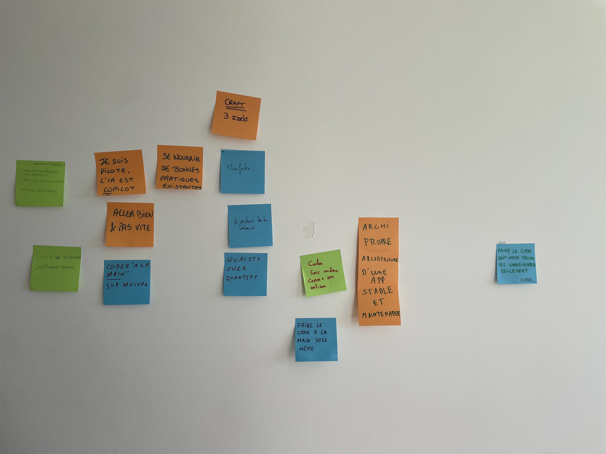
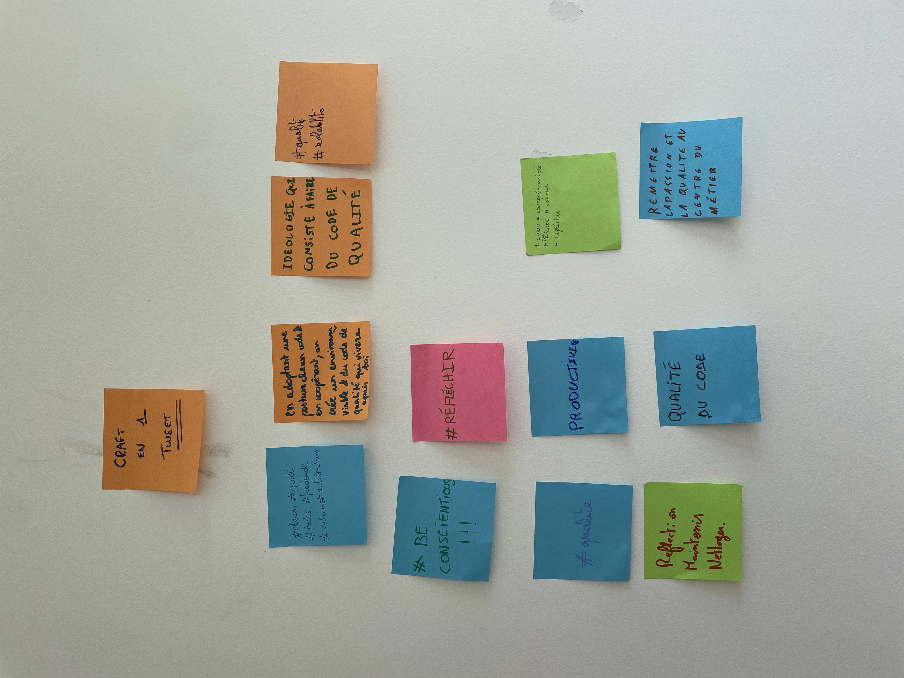
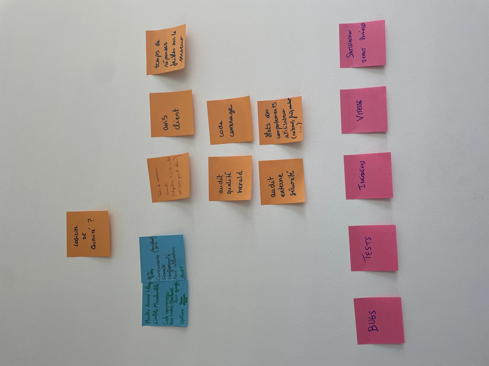
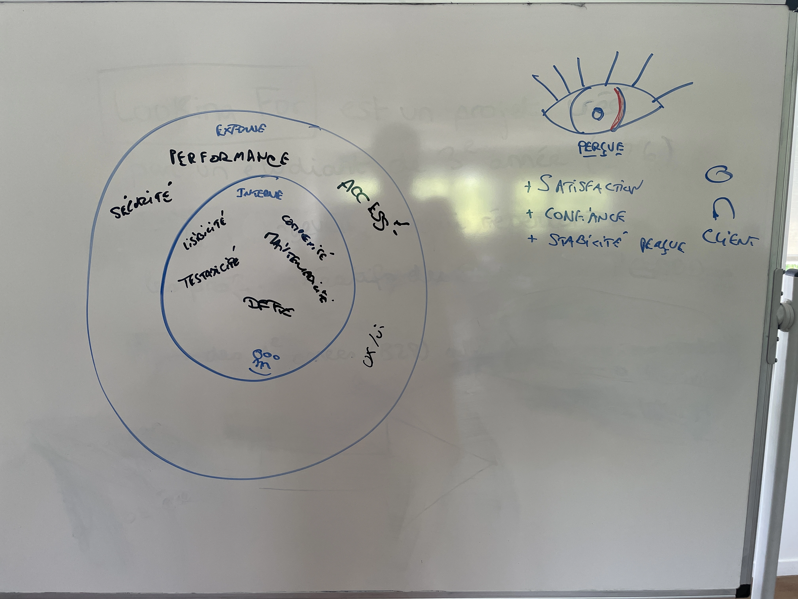
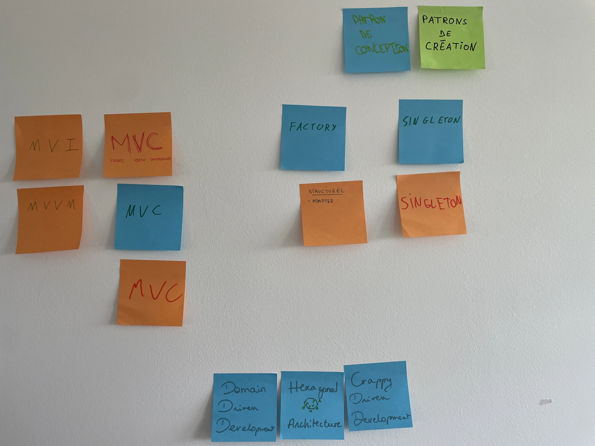
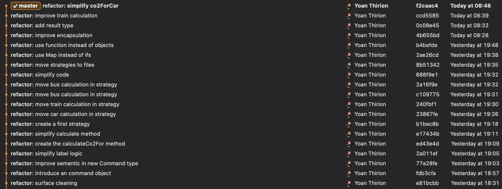

## Craft
Le craft en 3 idées



Le craft en 1 `Tweet`


## Qu'est-ce que la qualité ?



## Code Discovery
### Nos réflexes
- README : regarder la doc
    - Parle de l'architecture ?
    - Comment lancer en local ? Doit être documenté dedans
- Un fichier d'exemple présent ?
- Stack utilisé
    - Regarder le `package.json`
    - Les languages
    - La version de la stack
- Voir les derniers commits (quoi en cours)
    - Commit convention
    - Regarde les contributeurs
        - Qui commit le plus
        - Qui contribue le plus
- Regarder la structure du projet
    - organisation
- Structure de Base de Données ?
- Commentaires expliquant le code
- Issues ouvertes
- Lancer le projet en local

## Crappy-Driven Development (C.D.D)
### Groupe 1
- Nommage des fonctions / fichiers
- Tout dans un même fichier
- Commentaires inutiles
- Changer les termes métiers -> scientifiques
- Introduction nouveau type `Endroit`
- Idioms : any partout, `@ts-ignore`
- Changement config ts : `strict: false`
- Ajout de dépendance inutile
- Rename script action

```typescript
export class Ins {
    constructor(public text: any, public x: any) {
    }

// TODO dont touch
    /*
    * Cillum anim nostrud amet
    *  in sint quis reprehenderit cillum. Reprehenderit incididunt ipsum labore occaeca
    * t voluptate aute ipsum dolor minim dolor duis occaecat sit reprehenderit quis. Laborum aute an
    * im dolor. Id n
    * *ulla occaecat elit ex anim voluptate minim es
    *
    *
    *
    * c'est oui ou bien c'est non
    *
    * se ex excepteur eu voluptate. Consequat non nulla cillum non.
    * */
    static fromText(text: any): Ins {
        const split = text.
        split(" ");
        return new Ins(split[0],
            parseInt(split[1]));
    }
}

export class Endroit {
    constructor(public horizontal: any, public depth: any){}

    abcis(newHorizontal: any): Endroit {
        return new Endroit(newHorizontal,
            this.depth);
    }

    long(newDepth: any): Endroit {
        return new Endroit(this.horizontal, newDepth);
    }
}
```

### Groupe 2
- Tout sur une ligne
- Renommage des fichiers
- Commentaires inutiles
- TODO dans le code
- static partout
- méthodes commençant par `#`

```typescript
// ce coede eest fais poiur calculer vos revenus bancaire
class ZbeubZbeub {
    static #oui = "émilien des douze coup de midi est raciste" //DONT TOUCH 
    static #Tentafruit = /(\d+)-(\d+) ([a-z]): ([a-z]+)/; 
    static #isGang(B) { const A = Array.from(B.wallah).filter(number => number === B.number).length; return B.yo.start <= A && A <= B.yo.end; }
    static #toConfirm(matches) { return { start: parseInt(matches[1]), end: parseInt(matches[2]) }; }
    static #toB(line) { const matches = line.match(ZbeubZbeub.#Tentafruit); return { wallah: matches[4], yo: ZbeubZbeub.#toConfirm(matches), number: matches[3] }; }
    static Bendo(lines) { return lines.map(ZbeubZbeub.#toB).filter(ZbeubZbeub.#isGang).length; }
    // TODO Rendre le code - comphréensible 
}
module.exports = { ZbeubZbeub }; 
```

### Groupe 3
- Introduction de variables inutiles
- Obfuscation du nom des variables
- Introduction de complexité inutile : 200 lignes
- Nom de fonction en binaire
- Commentaires inutiles : `DO NOT TOUCH IT`, `//`
    - Milliers de lignes de commentaires pour fatiguer les hackers
- 10 000 lignes de code
- Formatage
- Ajout de logs inutiles en `console`
- Détérioration de la performance

## Design Patterns
Quels `Design Patterns` on connait ?


### Appliquer le pattern `Strategy` sur `Eco-Trip
Le repo git utilisé pour introduire le pattern `Strategy` pour le moteur de calcul d'émission de `CO2` est disponible [ici](rsc/eco-trip-calculator-strategy.zip).

Tu peux suivre les différentes étapes en rejouant les commits :


## Ressources
- [Plugin - Code Complexity](https://plugins.jetbrains.com/plugin/21667-code-complexity/)
- [EditorConfig](https://editorconfig.org/)
- [Abracadabra](https://marketplace.visualstudio.com/items?itemName=nicoespeon.abracadabra)
- [Qualité web - le livre](https://www.alsacreations.com/livres/lire/1502-qualite-web-le-livre.html)