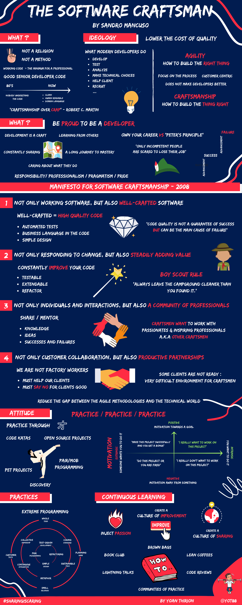

# Artisanat Logiciel
## 3 mots / idées (5–10 min)
Notez 3 mots ou idées que vous associez à *Artisanat logiciel* / *Software Craftsmanship*.

Travail :
* 1 min individuel
* 2 min en binôme
* Mise en commun visuelle

### Débriefe guidé
Regrouper les mots sous 4 familles :
* Qualité
* Professionnalisme
* Excellence technique
* Apprentissage continu

## The Software Craftsman (15–20 min)

## “Craft ou pas Craft ?” (15 min)
Travail en petits groupes :

1. En quoi, ce comportement est désaligné avec l’artisanat logiciel ?
2. Quel serait le comportement Craft ?
3. Quelles pratiques concrètes ? Quoi mettre en place ?

Détails de l'atelier [ici](CRAFT_PAS_CRAFT.md)

## Synthèse collective (10 min)
Revenir aux mots du début.

> “Après cette session, changeriez-vous un ou plusieurs de vos 3 mots ?”

L’artisanat logiciel ce n’est pas :

* Faire du code parfait
* Être élitiste
* Être dogmatique

C’est :

* Se comporter en professionnel
* Assumer la qualité
* Progresser en permanence
* Construire avec fierté

## Ressources
- [Infographie livre "The Software Craftsman"](resources/The%20Software%20Craftsman.pdf)
- [Livre "Software Craft - TDD, Clean Code et autres pratiques essentielles"](https://www.dunod.com/sciences-techniques/software-craft-tdd-clean-code-et-autres-pratiques-essentielles-0)
- [Chaine Youtube "Artisan Développeur"](https://www.youtube.com/@artisandeveloppeur)
- [Livre "The Pragmatic Programmer"](https://pragprog.com/titles/tpp20/the-pragmatic-programmer-20th-anniversary-edition/)