# Et si on parlait qualité ?
## “Comment sait-on qu’un logiciel est de qualité ?”
### Étape 1 — Individuel (3 min)

> Imagine que tu es CTO.
> Tu dois prouver au CEO que ton logiciel est de qualité.
> Quels indicateurs mets-tu dans ton dashboard ?

### Étape 2 — En groupes de 3 (5 min)

* Mise en commun
* Fusion des idées
* Choix de 5 indicateurs maximum

### Étape 3 — Mise en commun (5 min)

Regrouper au tableau par catégories :

* Vitesse (lead time, throughput…)
* Bugs (nombre, sévérité…)
* Tests (couverture, automatisation…)
* Incidents (prod, MTTR…)
* Satisfaction utilisateur / Impact business

> “Est-ce que toutes ces métriques mesurent vraiment la qualité ?
> Ou seulement une partie ?”

La qualité est un système mesurable à plusieurs niveaux.

## Les différentes "couches" de la qualité
### A. Les dimensions de la qualité
#### 1. Qualité interne

* Lisibilité du code
* Maintenabilité
* Modularité
* Complexité
* Dette technique
* Testabilité

#### 2. Qualité externe

* Fiabilité
* Performance
* Sécurité
* UX / UI
* Compatibilité

#### 3. Qualité perçue

* Satisfaction utilisateur
* Confiance
* Stabilité ressentie

> La qualité ne se limite pas aux bugs.

### B. Mesurer la performance organisationnelle

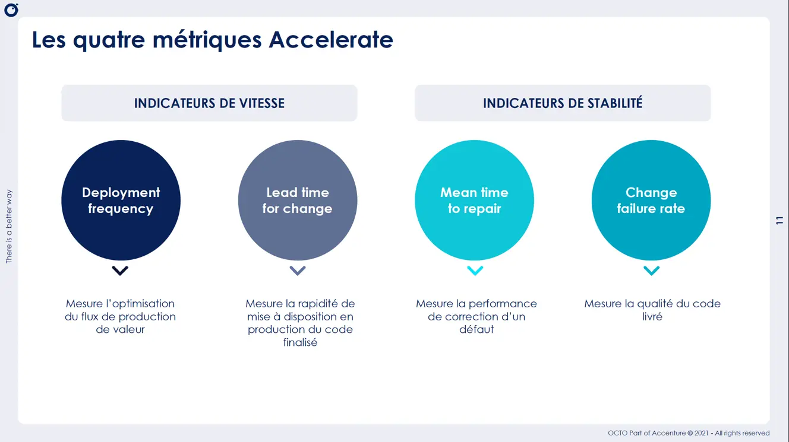
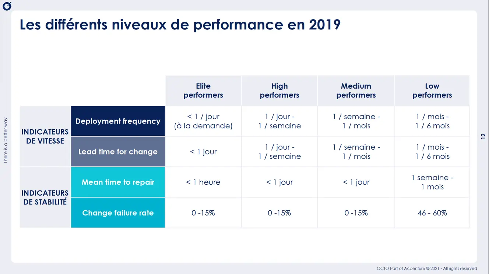
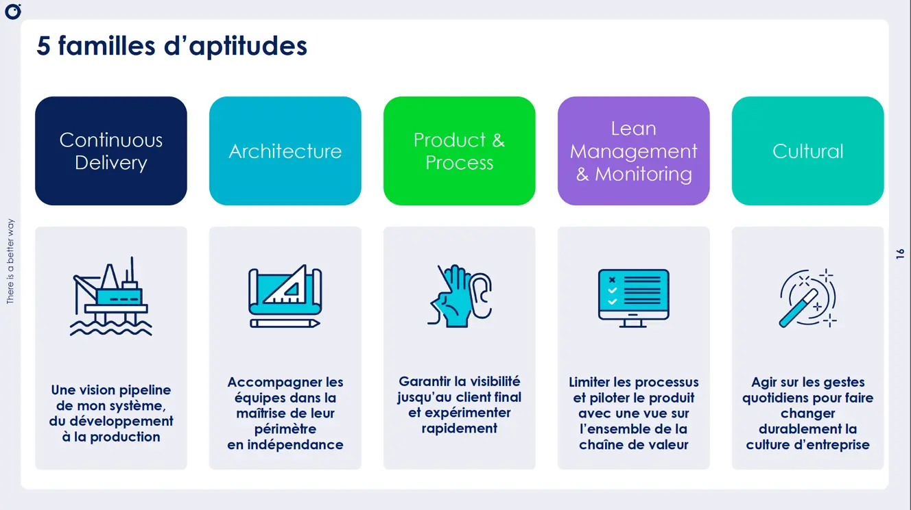
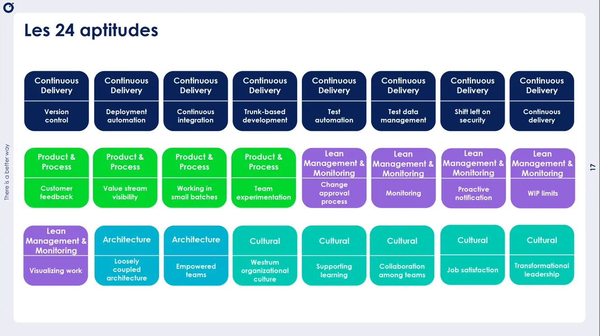
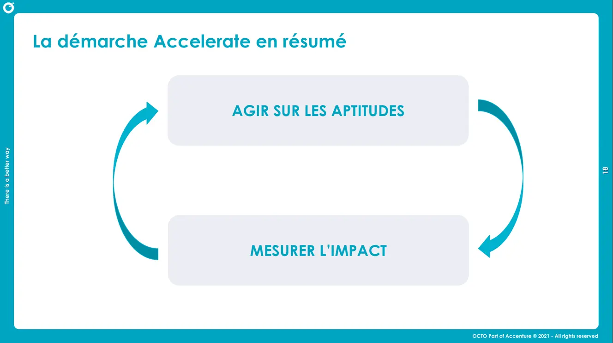

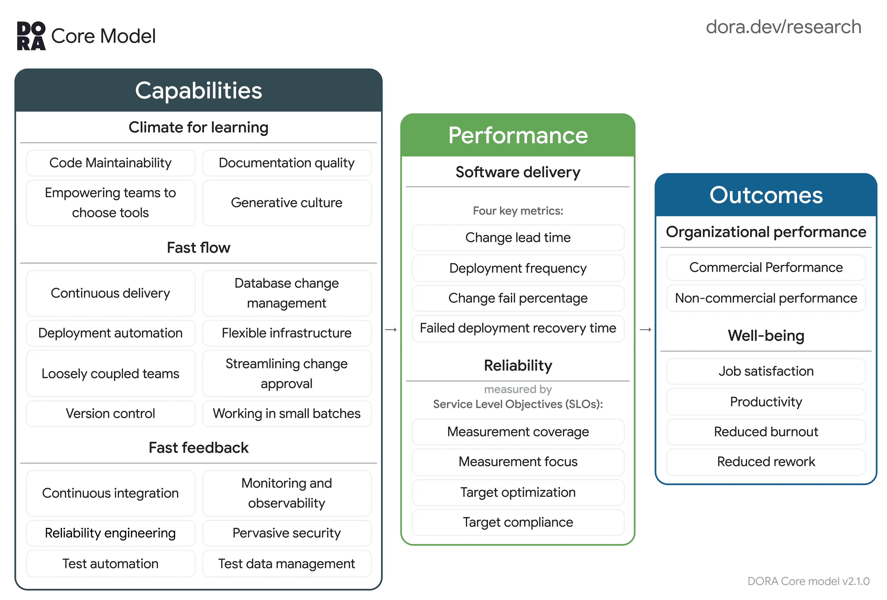

### C. Garantir la qualité
Waterfall process :
[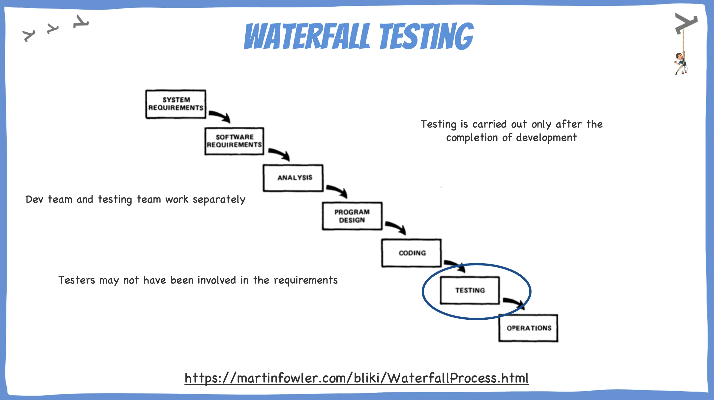](https://martinfowler.com/bliki/WaterfallProcess.html)
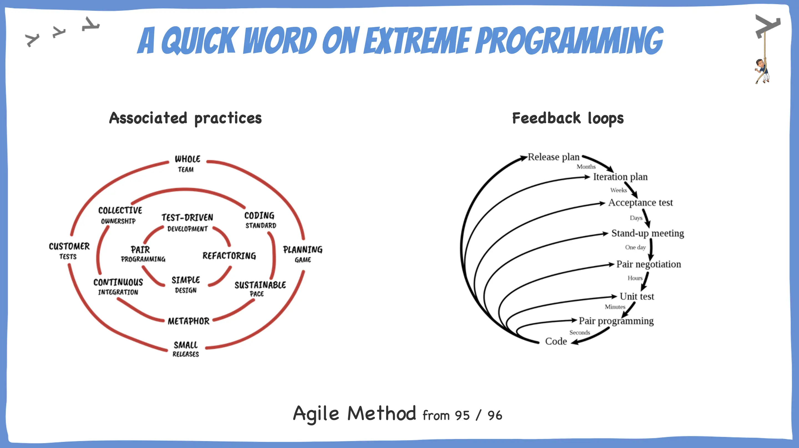
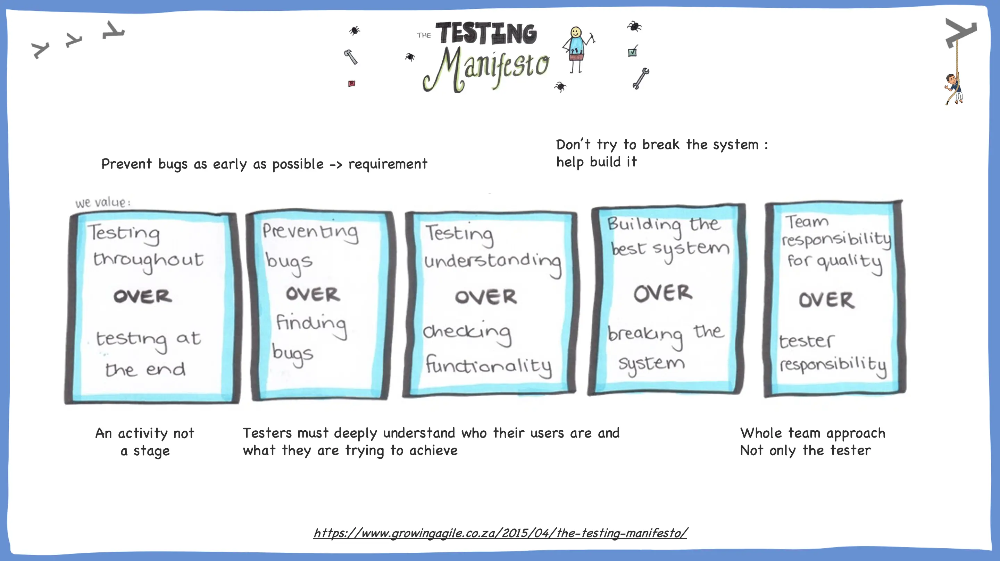
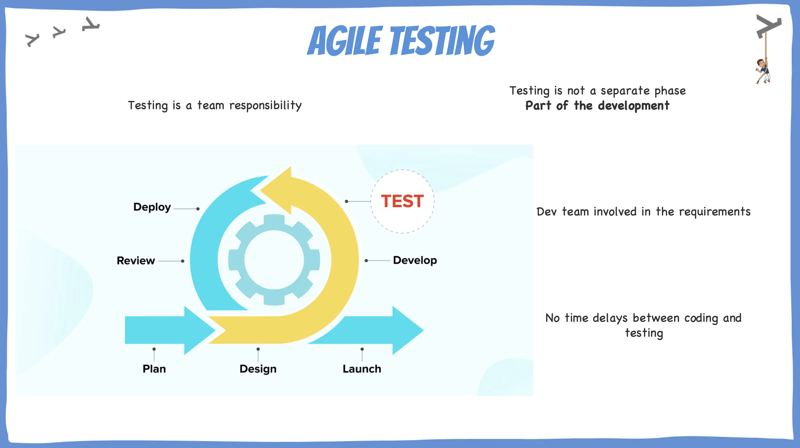
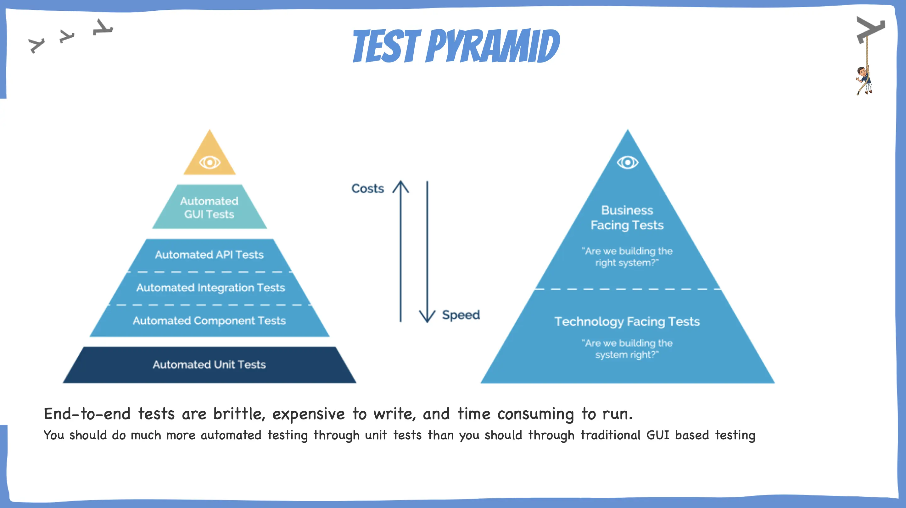

* Le test commence dès la définition du besoin
* Responsabilité collective
* Collaboration `PO` / `Dev` / `QA`
* Test comme activité continue

#### Les Quadrants de test
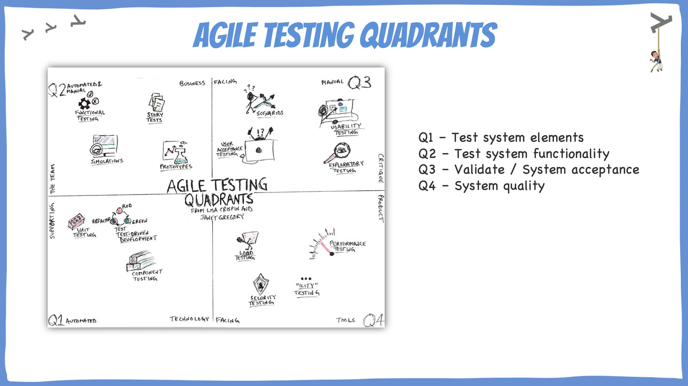

Quadrant 1 — Tests techniques supportant le dev

* Tests unitaires
* Tests d’intégration

Quadrant 2 — Tests business supportant le dev

* BDD
* Tests d’acceptation automatisés
* Exemples concrets

Quadrant 3 — Tests business critiquant le produit

* Exploratoire
* UAT
* Feedback utilisateur

Quadrant 4 — Tests techniques critiquant le produit

* Performance
* Sécurité
* Robustesse

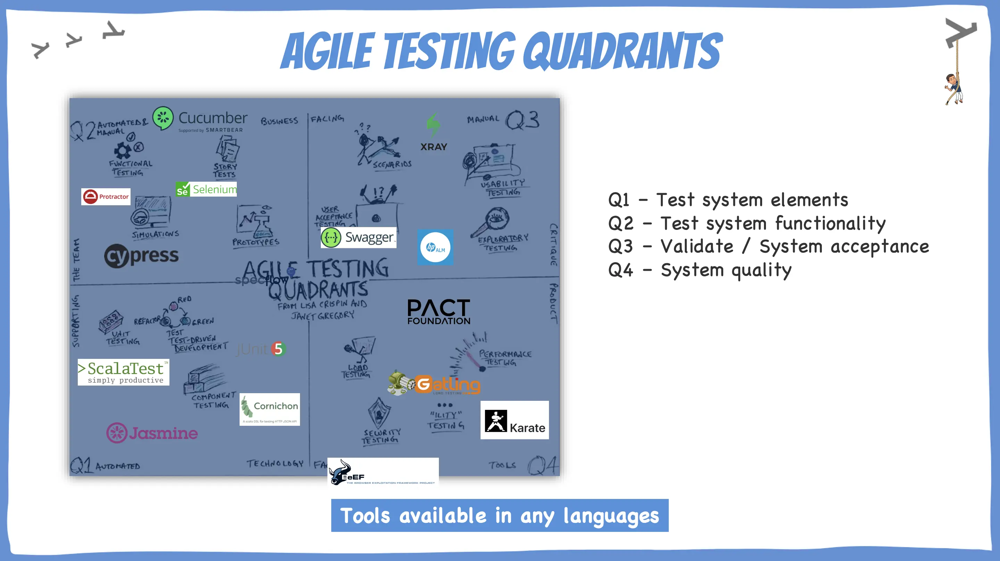

> Tous les tests ne servent pas la même finalité.

### D. Limites des métriques classiques

Sujets à couvrir :

* Couverture de code ≠ qualité
* Nombre de bugs ≠ maturité
* Story points ≠ valeur

> Que se passe-t-il quand on optimise une mauvaise métrique ?

## 50 nuances de tests
[Associer les différents tests à leur typologie](IDENTIFY_TESTS.md)

## Et dans mon contexte ?
Au vu de ce que nous venons de voir : 
- Qu'est-ce qui ferait sens d'expérimenter / introduire dans mon contexte ?
- Quelle est la première action que je peux lancer qui m'aide à tendre vers un mieux ?

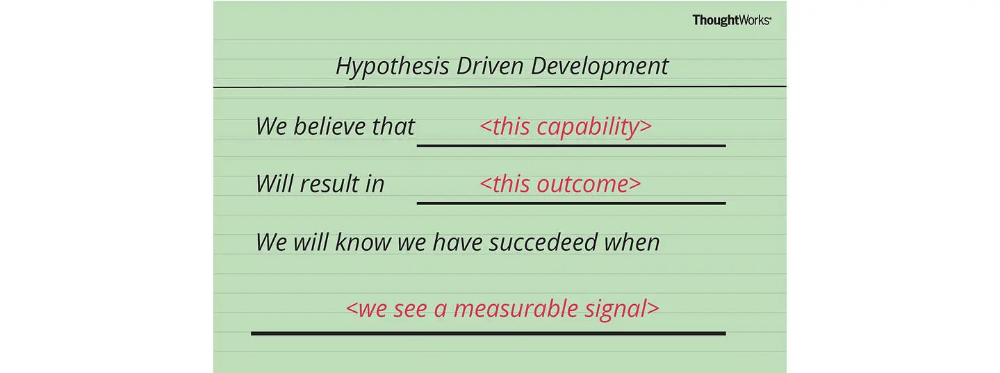

## Ressources
- [Unit Testing - Principles, Practices and Patterns - Vladimir Khorikov](resources/unit-testing-principles-practices-patterns.pdf)
- [Livre Accelerate](https://itrevolution.com/product/accelerate/)
- [Dora](https://dora.dev/)
- [The practical test pyramid](https://martinfowler.com/articles/practical-test-pyramid.html)
- [Integration test - Narrow vs Broad](https://martinfowler.com/bliki/IntegrationTest.html)
- [Test Desiderata par Kent Beck](https://testdesiderata.com/)
- [Loi de Goodhart](https://fr.wikipedia.org/wiki/Loi_de_Goodhart)
- [Effet Cobra](https://fr.wikipedia.org/wiki/Effet_cobra)