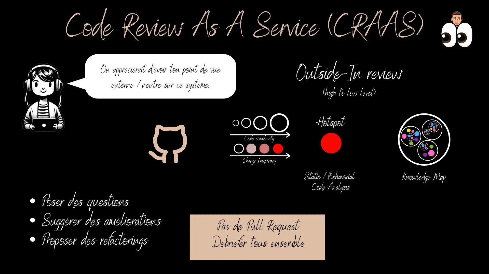
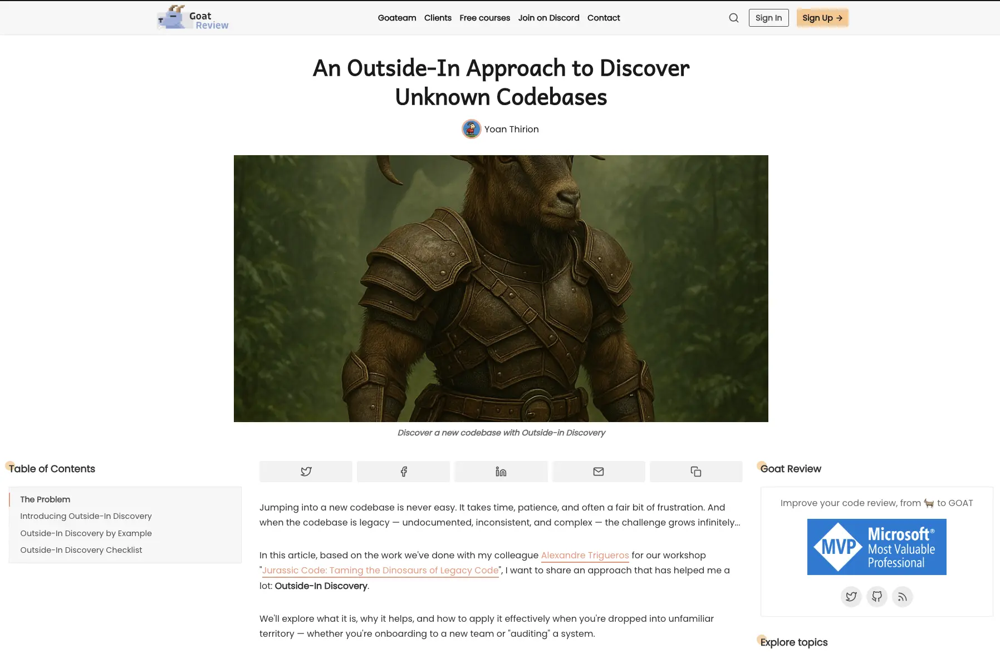

# Découvrir une nouvelle base de code
## Ce que je vis quand j'arrive sur un projet (10 min)
### Lister vos heuristiques

Ouvrez n'importe quelle base de code sur `github` :
- Lister toutes vos heuristiques / réflexes

### La tension avec l'IA générative

> "Avec GitHub Copilot, Cursor, Claude — est-ce que cette compétence est encore utile ?"

**Le paradoxe de l'IA générative :**

L'IA génère du code à grande vitesse. 

Mais elle génère du code **dans ton contexte** — et si tu ne comprends pas ce contexte, tu ne peux pas :
- lui donner les bonnes instructions (*garbage in, garbage out*)
- valider ce qu'elle produit (*code review sans filet*)
- détecter quand elle hallucine ou introduit une régression

**Et c'est là que ça devient contre-intuitif :** l'IA produit du code en volume bien supérieur à ce qu'un humain écrirait seul. Ce code, il faut quand même :
- le **comprendre** pour décider si on l'intègre
- le **maîtriser** pour itérer dessus sans tout casser
- l'**expliquer** à ses collègues ou lors d'une code review

Un développeur qui accepte du code qu'il ne comprend pas accumule de la **dette cognitive** — une forme de dette technique invisible, où personne dans l'équipe ne sait vraiment comment fonctionne ce qui a été livré. L'IA accélère la production de code, mais elle accélère aussi l'accumulation de cette dette si on ne développe pas la capacité à lire et comprendre ce qu'elle génère.

> Un dév qui ne comprend pas la base de code dans laquelle il travaille n'est pas accéléré par l'IA.
> Il est **amplifié dans ses erreurs**.

La compétence de découverte de code n'est pas remplacée par l'IA — elle devient **plus critique que jamais**, car les changements s'accumulent plus vite.

## Lire une codebase comme un détective (20 min)
### Pourquoi c'est difficile

Un codebase n'est pas un livre qu'on lit de la page 1 à la dernière. C'est un **système vivant** :
- Des décisions prises par des gens qui ne sont plus là
- Des compromis invisibles dans le code ("pourquoi ce `// DO NOT REMOVE`?")
- Des intentions non documentées
- Des strates d'évolution qui se superposent

L'objectif n'est pas de *tout comprendre*, c'est de **construire un modèle mental suffisant** pour agir avec confiance.

### Une approche : Outside-In Discovery

L'idée : partir de la **surface** (ce qui est visible de l'extérieur) et descendre progressivement vers les **détails d'implémentation**.

**Pourquoi dans cet ordre ?**
- On évite de se perdre dans les détails avant d'avoir compris le tout
- On construit un modèle mental progressif et cohérent
- On identifie plus vite les zones à risque ou à enjeux

## Comprendre un projet inconnu (25 min)
Prendre en main la base de code [`EcoTrip Calculator`](https://github.com/Coda-Dijon/eco-trip-calculator) qui nous servira de `fil rouge` en utilisant cette [checklist](CHECKLIST.md).

### Débriefe (10 min)
Tour de table : chaque groupe partage ses réponses.

Questions de debriefe :
> - "Qu'est-ce qui vous a le plus aidé à comprendre vite ?"
> - "Qu'est-ce qui vous a bloqué ?"
> - "Avez-vous utilisé l'IA ? Comment ? Est-ce que ça a aidé ou brouillé la lecture ?"
> - "Si vous aviez dû faire ça avec un collègue senior, qu'auriez-vous demandé en premier ?"

### Ce que l'IA ne fait pas à ta place

| Ce que l'IA peut faire      | Ce que toi seul peut faire                  |
|-----------------------------|---------------------------------------------|
| Résumer un fichier          | Décider si ce résumé est fiable             |
| Générer un diagramme        | Valider qu'il correspond à la réalité       |
| Expliquer un pattern        | Juger si ce pattern est bien appliqué       |
| Proposer une zone de départ | Évaluer le risque d'y toucher               |
| Lire le code à ta place     | Construire **ton** modèle mental du système |

> La compétence de découverte de code, c'est apprendre à **poser les bonnes questions**.
> L'IA peut t'aider à y répondre. Mais si tu ne sais pas quoi chercher, elle ne peut rien pour toi.

## Ressources
- [Outside-In Discovery - A structured way to understand Legacy Code](https://canva.link/4b9mxwe0oxw67js)
- [Outside-In approach — Goat Review](https://goatreview.com/outside-approach-discover-unknown-codebases/)
- [Outside-In Discovery AI Skill](https://github.com/ythirion/outside-in-code-review-skill)
- [Augmented Outside-In Discovery with Claude Code](https://goatreview.com/augmented-outside-in-discovery-with-claude-code/)
- [Board miro - Jurassic Code: Taming the Dinosaurs of Legacy Code](https://miro.com/app/board/uXjVINsPdaE=/?share_link_id=488006973224)
- [Focus refactoring on what matters with Hotspots Analysis](https://understandlegacycode.com/blog/focus-refactoring-with-hotspots-analysis/)

| Outil                                                        | Usage                                                                                                                                                                         |
|--------------------------------------------------------------|-------------------------------------------------------------------------------------------------------------------------------------------------------------------------------|
| [git-truck](https://github.com/git-truck/git-truck)          | Visualiser l'activité git par fichier/dossier — identifier les zones chaudes                                                                                                  |
| [CodeScene](https://codescene.com/)                          | Analyse comportementale du code : hotspots, dette sociale, complexité couplée à l'activité git. Détecte les zones qui concentrent les bugs et le turnover                     |
| [SonarQube](https://www.sonarsource.com/products/sonarqube/) | Analyse statique complète : bugs, vulnérabilités, code smells, dette technique estimée, duplications. Standard en entreprise                                                  |
| [Qodana](https://www.jetbrains.com/qodana/)                  | Analyse statique JetBrains, intégrable en CI. Supporte Java, Kotlin, JS/TS, Python, Go… Partage les règles avec les IDE JetBrains                                             |
| [JaCoCo](https://www.jacoco.org/)                            | Couverture Java, intégré à Maven/Gradle, rapport HTML et XML                                                                                                                  |
| [Stryker](https://stryker-mutator.io/)                       | Tests de mutation pour JS/TS (et C#, Scala). Introduit des mutations dans le code et vérifie que vos tests les détectent — révèle les tests superficiels                      |
| [PiTest](https://pitest.org/)                                | Tests de mutation pour Java/JVM. Rapide, intégré à Maven/Gradle. Référence dans l'écosystème Java                                                                             |
| [libyear](https://libyear.com/)                              | Mesure l'âge cumulé des dépendances en "années-librairie". Un projet à 10 libyears a des dépendances en retard de 10 ans au total — indicateur simple de dette de mise à jour |
