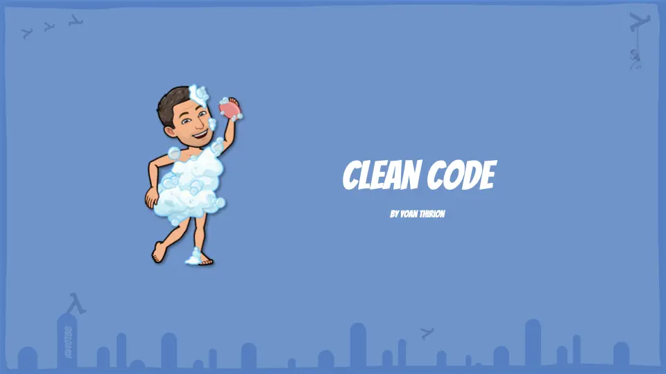

## Clean Code
[Atelier "Crappy-Driven Development"](crappy-driven-development/)

### Slides
[](resources/clean-code.pptx)

### Code Smells

Un **code smell** est un symptôme dans le code qui signale un problème de conception sous-jacent. 
Ce n'est pas forcément un bug — le code peut fonctionner — mais il révèle une fragilité, une difficulté à lire ou à faire évoluer le système.

> Source : *Refactoring* — Martin Fowler (2e éd.) · [Catalogue en ligne](https://refactoring.guru/refactoring/smells)

#### Gonflants *(Bloaters)*
Code qui a grossi au point de devenir difficile à manipuler.

| Smell                               | Signal                                                                                |
|-------------------------------------|---------------------------------------------------------------------------------------|
| **Méthode longue**                  | Une méthode qui fait trop de choses — plus de ~10 lignes devrait questionner          |
| **Classe trop large**               | Trop de responsabilités dans une seule classe (violation du SRP)                      |
| **Liste de paramètres trop longue** | Plus de 3-4 paramètres → souvent signe d'un objet manquant                            |
| **Obsession des primitives**        | Utiliser `string`, `int`, `boolean` là où un type métier serait plus expressif        |
| **Groupes de données**              | Des données qui voyagent toujours ensemble mais ne sont pas encapsulées dans un objet |

#### Abus d'orienté-objet *(OO Abusers)*
Utilisation incorrecte ou partielle des principes OO.

| Smell                                             | Signal                                                                    |
|---------------------------------------------------|---------------------------------------------------------------------------|
| **Switch / longue chaîne de if-else**             | Souvent remplaçable par du polymorphisme                                  |
| **Champ temporaire**                              | Un attribut qui n'a de sens que dans certaines conditions                 |
| **Refus d'héritage** *(Refused Bequest)*          | Une sous-classe qui n'utilise pas (ou rejette) les méthodes de son parent |
| **Classes alternatives à interfaces différentes** | Deux classes font la même chose mais avec des noms de méthodes différents |

#### Freineurs de changement *(Change Preventers)*
Code qui rend chaque modification douloureuse.

| Smell                                                | Signal                                                                                       |
|------------------------------------------------------|----------------------------------------------------------------------------------------------|
| **Changement divergent**                             | Modifier une fonctionnalité oblige à changer une même classe à plusieurs endroits différents |
| **Chirurgie au fusil de chasse** *(Shotgun Surgery)* | Un seul changement logique force des modifications dans de nombreuses classes                |
| **Hiérarchies d'héritage parallèles**                | Ajouter une sous-classe dans une hiérarchie force à en créer une dans une autre              |

#### Dispensables
Ce qui pollue le code sans apporter de valeur.

| Smell                             | Signal                                                                                      |
|-----------------------------------|---------------------------------------------------------------------------------------------|
| **Code dupliqué**                 | Le même bloc logique existe à plusieurs endroits — DRY (Don't Repeat Yourself)              |
| **Classe fantôme** *(Lazy Class)* | Une classe qui ne fait pas assez pour justifier son existence                               |
| **Code mort**                     | Code jamais appelé, variables jamais lues, branches jamais atteintes                        |
| **Généralité spéculative**        | Code écrit "au cas où" pour un besoin futur hypothétique — YAGNI                            |
| **Commentaire**                   | Un commentaire qui explique *ce que* fait le code (signe que le code manque d'expressivité) |

#### Coupleurs *(Couplers)*
Code qui crée des dépendances trop fortes entre classes.

| Smell                                            | Signal                                                                         |
|--------------------------------------------------|--------------------------------------------------------------------------------|
| **Feature Envy**                                 | Une méthode qui s'intéresse plus aux données d'une autre classe qu'aux siennes |
| **Intimité déplacée** *(Inappropriate Intimacy)* | Deux classes qui accèdent trop aux détails internes l'une de l'autre           |
| **Chaîne de messages** *(Message Chains)*        | `a.getB().getC().getD().doSomething()` — violation de la loi de Déméter        |
| **Homme du milieu** *(Middle Man)*               | Une classe dont le seul rôle est de déléguer à une autre                       |

### Linter & Analyse Statique

Un linter lit le code **sans l'exécuter** et signale les violations de règles de style, les patterns dangereux et les code smells automatiquement détectables. C'est la première ligne de défense — rapide, objective, intégrable en CI.

#### Ce que le linter détecte (et ce qu'il ne détecte pas)

| Linter détecte                        | Linter ne détecte pas           |
|---------------------------------------|---------------------------------|
| Variables déclarées mais inutilisées  | Mauvaise conception métier      |
| Imports inutiles                      | Feature Envy, Shotgun Surgery   |
| Complexité cyclomatique trop élevée   | Code correct mais illisible     |
| Code dupliqué (certains outils)       | Tests insuffisants              |
| Conventions de nommage non respectées | Couplage excessif entre modules |

> Le linter automatise la partie mécanique de la code review. Il libère du temps pour ce qui demande du jugement humain.

#### Outils

| Outil                                                  | Contexte        | Ce qu'il apporte                                                          |
|--------------------------------------------------------|-----------------|---------------------------------------------------------------------------|
| [ESLint](https://eslint.org/)                          | JS / TS         | Règles configurables, plugins (React, import, unicorn…), fix automatique  |
| [Prettier](https://prettier.io/)                       | JS/TS/CSS/JSON… | Formatage automatique — élimine les débats de style                       |
| [typescript-eslint](https://typescript-eslint.io/)     | TS              | Règles tirant parti du système de types                                   |
| [SonarQube / SonarCloud](https://www.sonarsource.com/) | Multi-langage   | Analyse approfondie : bugs, vulnérabilités, dette technique, duplications |
| [Checkstyle](https://checkstyle.org/)                  | Java            | Conventions de code, nommage, structure                                   |
| [PMD](https://pmd.github.io/)                          | Java / Apex     | Code smells, code mort, règles de sécurité                                |

#### Intégration recommandée

```
Développeur         → lint au save (IDE) + pre-commit hook
Pull Request        → lint + analyse statique en CI (bloquant si quality gate échoue)
Dashboard équipe    → rapport SonarQube par exemple (suivi dans le temps)
```

#### Exemple de configuration ESLint (TypeScript)

```json
// eslint.config.js (flat config)
import tseslint from 'typescript-eslint'

export default tseslint.config(
  ...tseslint.configs.recommended,
  {
    rules: {
      '@typescript-eslint/no-explicit-any': 'error',
      '@typescript-eslint/no-unused-vars': 'error',
      'complexity': ['warn', { max: 10 }],
      'max-lines-per-function': ['warn', { max: 30 }],
    }
  }
)
```

### Le Clean Code s'applique aussi aux tests

> "Les tests doivent être aussi soignés que le code de production."
> — Robert C. Martin, *Clean Code*

Un test mal écrit est aussi un problème : il est difficile à comprendre, fragile à maintenir et trompeur sur ce qu'il couvre réellement. Les mêmes principes s'appliquent.

#### Les principes F.I.R.S.T.

| Principe            | Description                                                                               |
|---------------------|-------------------------------------------------------------------------------------------|
| **F**ast            | Les tests unitaires doivent s'exécuter en millisecondes. Un test lent n'est pas lancé.    |
| **I**ndependent     | Chaque test doit être isolé. L'ordre d'exécution ne doit pas avoir d'importance.          |
| **R**epeatable      | Même résultat à chaque run, quel que soit l'environnement ou l'heure.                     |
| **S**elf-validating | Le test dit lui-même s'il passe ou échoue — pas besoin d'inspecter des logs manuellement. |
| **T**imely          | Écrire les tests au bon moment — idéalement avant le code (TDD).                          |

#### Code smells spécifiques aux tests

| Smell                               | Description                                                                                                              |
|-------------------------------------|--------------------------------------------------------------------------------------------------------------------------|
| **Mystery Guest**                   | Le test dépend d'une fixture externe (fichier, DB, config) non visible dans le test lui-même                             |
| **Setup monstre**                   | Un `beforeEach` de 50 lignes qui prépare un contexte opaque — le test ne se comprend pas seul                            |
| **Assertions multiples non liées**  | Un test qui vérifie trop de choses — si l'une échoue, on ne sait pas laquelle et pourquoi                                |
| **Test logic in tests**             | Des `if`, des boucles, des calculs dans le test — le test lui-même peut contenir un bug                                  |
| **Nom de test opaque**              | `test1()`, `shouldWork()`, `testCalculate()` — le nom ne documente pas le comportement attendu                           |
| **Test fragile** *(Flaky test)*     | Passe parfois, échoue parfois — souvent lié à du temps, de l'aléatoire ou des effets de bord                             |
| **Code de production dans le test** | Réimplémenter une logique dans le test pour calculer la valeur attendue — on teste alors deux implémentations identiques |

#### Ce que ça donne en pratique

```typescript
// ❌ Test difficile à lire
it('test score', () => {
  const d = [3, 3, 3, 5, 1]
  const s = new S()
  expect(s.calc(d, 'b')).toBe(d.filter(x => x === 3).length * 3)
})

// ✅ Test expressif
it('calcule le score du brelan comme la somme des trois dés identiques', () => {
  const lancerAvecBrelanDe3 = [3, 3, 3, 5, 1]

  const score = calculerBrelan(lancerAvecBrelanDe3)

  expect(score).toBe(9)
})
```

Un bon test est une **documentation vivante** : il décrit le comportement attendu du système, et ce test passera encore dans 3 ans sans qu'on ait besoin de déchiffrer ce qu'il fait.

### Ressources

#### Livres

- [Clean Code](https://www.oreilly.com/library/view/clean-code-a/9780136083238/) — Robert C. Martin
- [Refactoring: Improving the Design of Existing Code](https://martinfowler.com/books/refactoring.html) — Martin Fowler (2e éd.)
- [The Programmer's Brain](https://www.manning.com/books/the-programmers-brain) — Felienne Hermans
- [Software Craft — TDD, Clean Code et autres pratiques essentielles](https://www.dunod.com/sciences-techniques/software-craft-tdd-clean-code-et-autres-pratiques-essentielles-0) — Cyrille Martraire et al.

#### Références en ligne

- [Catalogue des code smells — Refactoring Guru](https://refactoring.guru/refactoring/smells)
- [Catalogue des refactorings — Martin Fowler](https://refactoring.com/catalog/)
- [The Four Elements of Simple Design — J.B. Rainsberger](https://blog.jbrains.ca/permalink/the-four-elements-of-simple-design)
- [Samman Technical Coaching — Code Smells](https://sammancoaching.org/catalogue/code_smells.html)