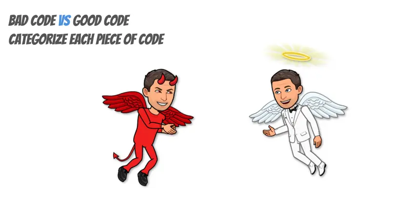
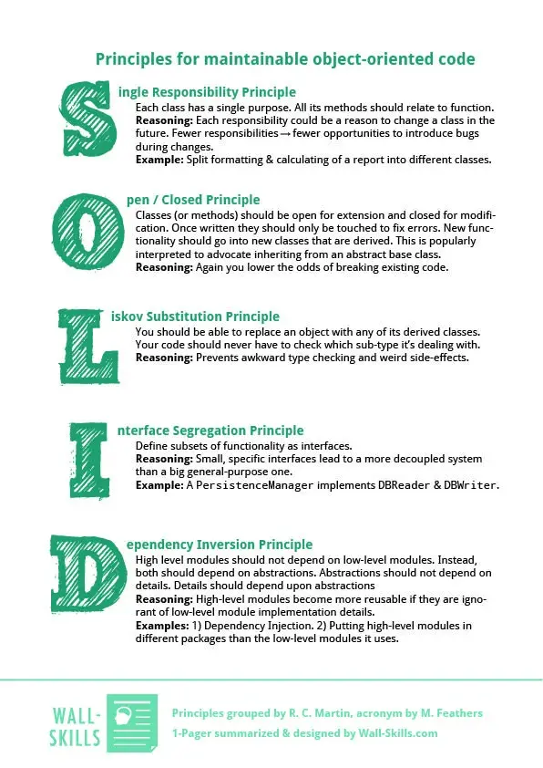

# Écrire du code S.O.L.I.D

## Bad Code / Good Code

### Partie 1
Analyser les extraits de code :
- Prenez 5 minutes pour les découvrir
- Notez ce qui vous gêne, ce qui vous semble bizarre ou fragile
- Catégoriser les en `Good` vs `Bad`

> Il n'y a pas de mauvaise réponse — faites confiance à votre instinct de dév.

### Partie 2
On ajoute les cartes `S.O.L.I.D` afin de créer une matrice :
- Identifiez quels principes S.O.L.I.D sont violés et pourquoi
- Comparez vos trouvailles avec celles d'un autre groupe

## Les 5 principes S.O.L.I.D
Slides de correction disponibles [ici](resources/SOLID%20Principles.pptx). 

| Lettre | Principe              | En une phrase                                                     |
|--------|-----------------------|-------------------------------------------------------------------|
| **S**  | Single Responsibility | Une classe = une seule raison de changer                          |
| **O**  | Open/Closed           | Ouvert à l'extension, fermé à la modification                     |
| **L**  | Liskov Substitution   | Un sous-type doit pouvoir remplacer son parent                    |
| **I**  | Interface Segregation | Préférez plusieurs interfaces spécifiques à une seule généraliste |
| **D**  | Dependency Inversion  | Dépendez des abstractions, pas des implémentations                |

## En pratique
En binôme, ouvrir un kata disponible dans [solid-kata](solid-kata/)
- Appliquez le principe ciblé, un pas à la fois
- Si vous terminez un kata, passez au suivant ou explorez une variante

> **Conseil :** ne cherchez pas la perfection du premier coup. Faites d'abord fonctionner, puis refactorer en appliquant le principe.

## Où j'en suis ?
- Est-ce que je reconnais ce principe dans du code que j'ai déjà écrit ou lu ?
- Où est-ce que je l'ai peut-être violé sans le savoir ?

## Ressources
- [Write SOLID Code](https://yoan-thirion.gitbook.io/knowledge-base/software-craftsmanship/code-katas/write-s.o.l.i.d-code)
- [Why every element of SOLID is wrong](https://speakerdeck.com/tastapod/why-every-element-of-solid-is-wrong)
- [CUPID is the new SOLID](https://speakerdeck.com/tastapod/cupid-for-joyful-coding)