# Design Patterns (GOF)
## Patterns, vous avez dit patterns ?

En groupe, prenez 5 minutes :
- Citez tous les design patterns que vous connaissez
- Classez-les en catégories : qu'est-ce qui les regroupe ?

## Gang of Four (1994)

|                                             |                                                                                       |
|:-------------------------------------------:|:-------------------------------------------------------------------------------------:|
|  | 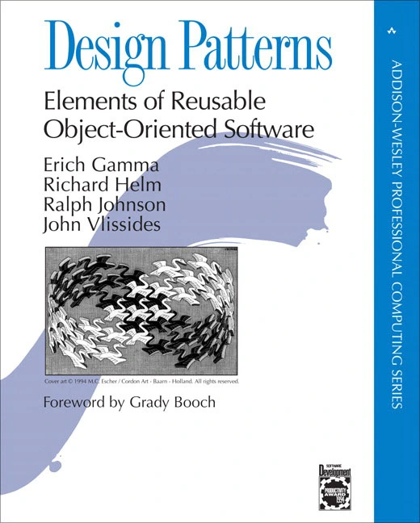 |

En 1994, Erich Gamma, Richard Helm, Ralph Johnson et John Vlissides publient **"Design Patterns: Elements of Reusable Object-Oriented Software"** — l'un des livres les plus influents de l'histoire du génie logiciel.

Leur contribution : **23 patterns** catalogués, nommés et documentés, chacun décrivant une solution éprouvée à un problème récurrent de conception orientée objet.

> "Each pattern describes a problem which occurs over and over again in our environment, and then describes the core of the solution to that problem, in such a way that you can use this solution a million times over."
> — Christopher Alexander (cité dans le GOF)

## Les 3 familles de patterns

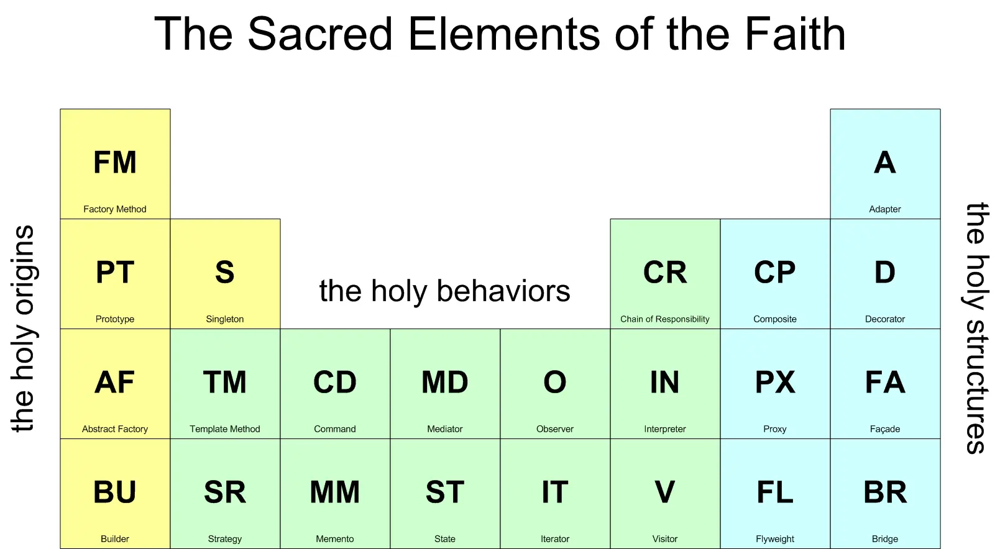

Les 23 patterns sont regroupés en **3 familles** selon leur intention :

| Famille                            | Intention                                                             | Exemples                                                               |
|------------------------------------|-----------------------------------------------------------------------|------------------------------------------------------------------------|
| **Créationnels** *(Creational)*    | Comment créer des objets de façon flexible et découplée               | Factory Method, Abstract Factory, Builder, Prototype, **Singleton**    |
| **Structuraux** *(Structural)*     | Comment assembler des objets et des classes en structures plus larges | **Adapter**, Decorator, Façade, Composite, Proxy, Bridge, Flyweight    |
| **Comportementaux** *(Behavioral)* | Comment les objets interagissent et répartissent les responsabilités  | **Strategy**, **State**, Observer, Command, Template Method, Iterator… |

---

## Adapter *(Structural)*
> Aussi connu sous le nom de **Wrapper**.

Le pattern Adapter permet à des classes aux interfaces incompatibles de collaborer ensemble. Il crée une abstraction intermédiaire qui traduit l'interface d'un composant existant vers celle attendue par le reste du système.

**Cas d'usage typique :** intégrer un composant legacy dans un nouveau système sans modifier ni l'un ni l'autre.

Il permet de :
- Convertir l'interface d'une classe en une autre interface attendue par le client
- Faire collaborer des classes qui ne pourraient pas l'être autrement
- Encapsuler un composant existant derrière une nouvelle interface

### Cas concret — Media Player

Un `AudioPlayer` doit lire des fichiers MP3, VLC et MP4. Les lecteurs VLC et MP4 exposent une interface `AdvancedMediaPlayer` différente de `MediaPlayer`.

#### ❌ Avant — couplage direct avec `if/else`

```java
public class AudioPlayer {
    public void play(String audioType, String fileName) {
        if (audioType.equals("mp3")) {
            System.out.println("Playing MP3: " + fileName);
        } else if (audioType.equals("vlc")) {
            new VlcPlayer().playVlc(fileName); // interface incompatible
        } else if (audioType.equals("mp4")) {
            new Mp4Player().playMp4(fileName); // interface incompatible
        }
        // ⚠ Ajouter AVI impose de modifier cette classe
    }
}
```

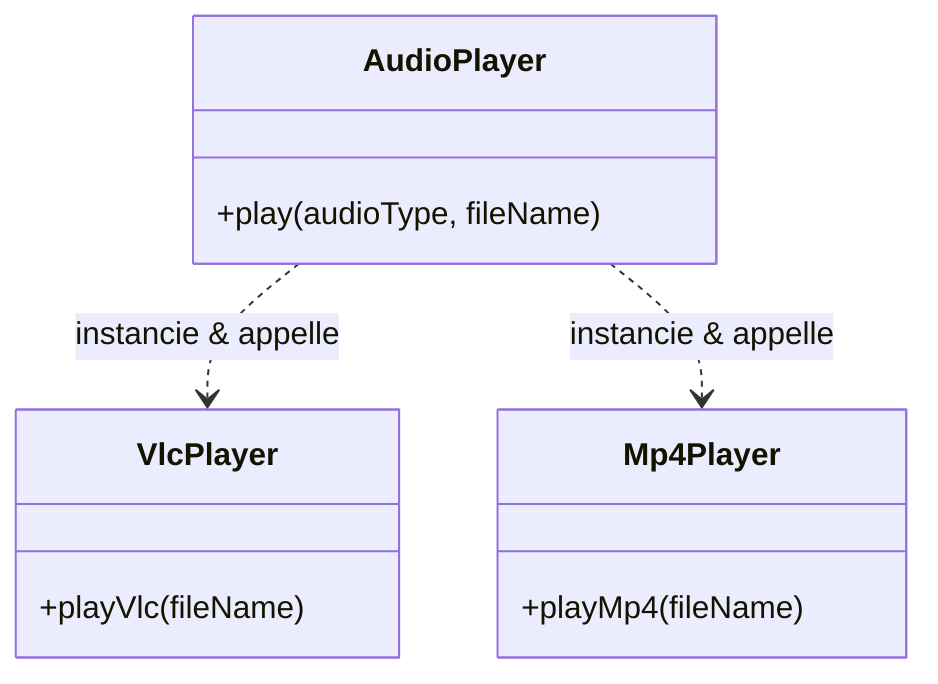

#### ✅ Après — Adapter Pattern

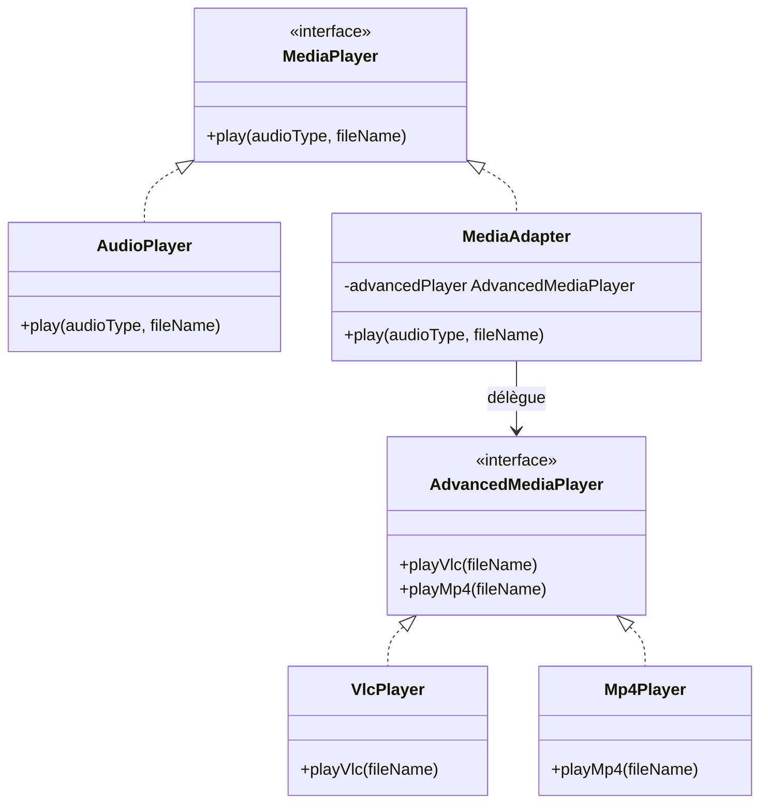

`AudioPlayer` ne connaît que `MediaPlayer`. `MediaAdapter` fait le pont — ajouter `AviPlayer` ne touche pas à `AudioPlayer`.

Plus d'infos [ici](https://refactoring.guru/design-patterns/adapter).

---

## State *(Behavioral)*

Le pattern State permet à un objet de **modifier son comportement lorsque son état interne change** — comme si l'objet changeait de classe à l'exécution.

### La machine à états finis

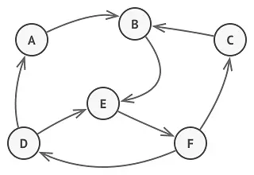

À tout instant, un programme peut se trouver dans un **nombre fini d'états**. Dans chaque état, le programme se comporte différemment. Les règles qui définissent le passage d'un état à l'autre s'appellent des **transitions**.

### Structure du pattern

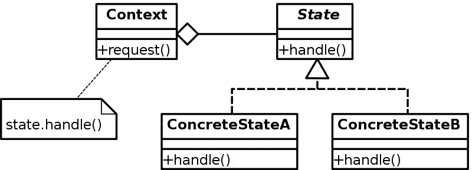

- **Context** : l'objet dont le comportement varie. Il délègue tout le travail lié à l'état à l'objet `State` courant.
- **State** : interface commune à tous les états concrets.
- **ConcreteState** : implémente le comportement associé à un état précis.

### Comment l'appliquer

1. Créer une classe par état possible de l'objet
2. Extraire les comportements spécifiques à chaque état dans ces classes
3. L'objet original (le *contexte*) conserve une référence vers l'état courant
4. Il délègue les appels à cet objet état

### Cas concret — Workflow documentaire

Un document suit un cycle de vie avec des règles de transition strictes : Draft → Review → Published, avec possibilité de rejet à chaque étape.

#### Diagramme d'états

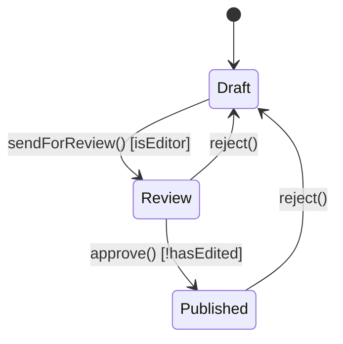

#### ❌ Avant — tout dans une seule classe avec `if/else`

```java
public class Document {
    private String status = "DRAFT";

    public void edit() {
        if (status.equals("REVIEW"))      throw new IllegalStateException("Cannot edit in REVIEW");
        if (status.equals("PUBLISHED"))   throw new IllegalStateException("Cannot edit in PUBLISHED");
        System.out.println("Editing document...");
    }

    public void sendForReview(User user) {
        if (!status.equals("DRAFT"))      throw new IllegalStateException("Only DRAFT can be sent for review");
        if (!user.isEditor())             throw new IllegalStateException("Only editors can send for review");
        status = "REVIEW";
    }

    public void approve(User user) {
        if (!status.equals("REVIEW"))     throw new IllegalStateException("Only REVIEW can be approved");
        if (user.hasEdited(this))         throw new IllegalStateException("Editor cannot approve own document");
        status = "PUBLISHED";
    }

    public void reject() {
        if (status.equals("DRAFT"))       throw new IllegalStateException("Cannot reject a DRAFT");
        status = "DRAFT";
    }
    // ⚠ Ajouter un état ARCHIVED impose de modifier chacune de ces méthodes
}
```

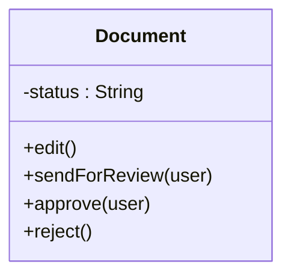

#### ✅ Après — State Pattern

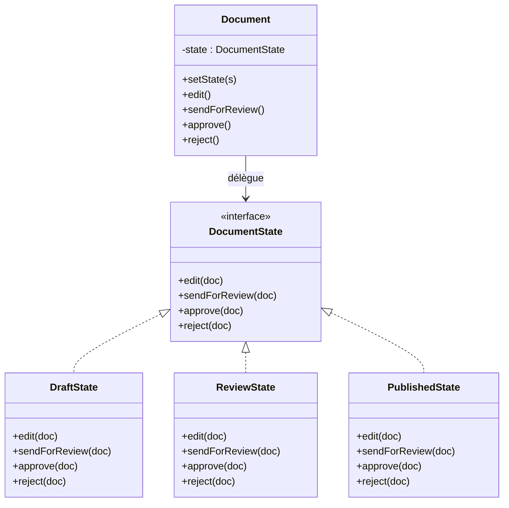

Ajouter un état `Archived` revient à créer `ArchivedState` — sans toucher à `Document` ni aux autres états.

### Avantages et limites

| ✅ Avantages                                                 | ⚠️ Limite                                                         |
|-------------------------------------------------------------|-------------------------------------------------------------------|
| *Single Responsibility* : chaque état dans sa propre classe | Peut être excessif si la machine a peu d'états ou évolue rarement |
| *Open/Closed* : ajouter un état sans toucher aux autres     | —                                                                 |
| Élimine les longues chaînes de `if/else` conditionnels      | —                                                                 |

Plus d'infos [ici](https://refactoring.guru/design-patterns/state).

---

## Strategy *(Behavioral)*

Le pattern Strategy consiste à **extraire un algorithme de sa classe hôte** pour le placer dans une classe dédiée. Plusieurs stratégies (algorithmes) peuvent ainsi coexister et être **sélectionnées à l'exécution** selon le contexte.

**Piloté par le principe Open/Closed :**
- Le contexte n'a pas besoin d'être modifié *(fermé à la modification)*
- De nouvelles stratégies peuvent être ajoutées librement *(ouvert à l'extension)*

### Structure du pattern

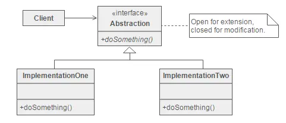

- **Abstraction** (interface) : définit le contrat commun à toutes les stratégies
- **ImplementationOne / ImplementationTwo** : les stratégies concrètes
- **Client** : choisit et injecte la stratégie dans le contexte — sans connaître son implémentation

### Comment l'appliquer

1. Créer une **interface** représentant l'abstraction de l'algorithme
2. Créer une **implémentation concrète** par variante — ce sont les *stratégies*
3. Le client appelle toujours l'interface, en passant un objet de contexte
4. Le contexte décide quelle stratégie utiliser

### Cas concret — Réseau social

Une application connecte un utilisateur à ses amis sur différentes plateformes. Le client précise le nom de l'ami et la plateforme cible — l'application gère la connexion.

#### ❌ Avant — `switch` sur la plateforme dans le contexte

```java
public class SocialConnector {
    public void connect(String platform, String friendName) {
        switch (platform) {
            case "facebook":
                // logique spécifique Facebook (login, API, token...)
                System.out.println("Connecting " + friendName + " via Facebook");
                break;
            case "instagram":
                // logique spécifique Instagram
                System.out.println("Connecting " + friendName + " via Instagram");
                break;
            case "twitter":
                // logique spécifique Twitter
                System.out.println("Connecting " + friendName + " via Twitter");
                break;
            // ⚠ Ajouter LinkedIn impose de modifier cette classe et de retester tout
        }
    }
}
```

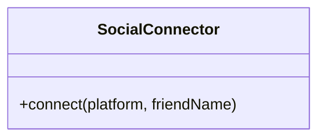

#### ✅ Après — Strategy Pattern

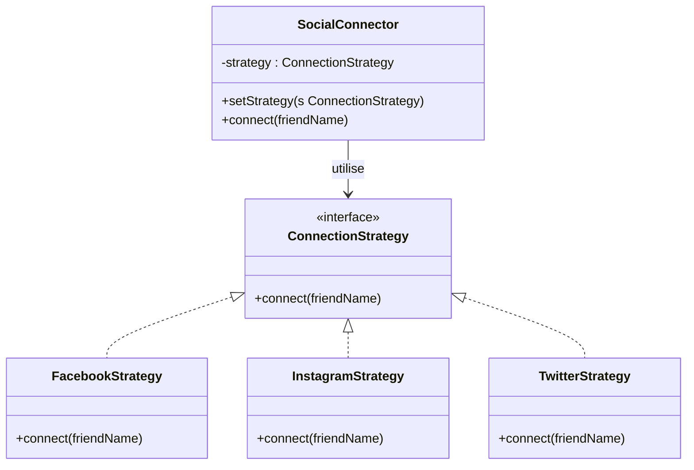

Ajouter `LinkedInStrategy` ne touche ni à `SocialConnector` ni aux stratégies existantes. Chaque stratégie est testable indépendamment.

Plus d'infos [ici](https://refactoring.guru/design-patterns/strategy).

---

## Singleton *(Creational)*

Le Singleton **restreint l'instanciation d'une classe à un seul objet**. Utile quand un unique objet doit coordonner des actions à l'échelle du système (logger, pool de connexions, configuration…).

### Problèmes résolus

- Comment garantir qu'une classe n'a qu'une seule instance ?
- Comment accéder facilement à cette instance unique ?
- Comment empêcher toute instanciation supplémentaire ?

**Solution :** rendre le constructeur privé et exposer une méthode statique `getInstance()`.

### ❌ Implémentation naïve (non thread-safe)

```java
public final class Example {
    private Example instance = null;
    private Example() {}

    public static Example getInstance() {
        if (instance == null) {
            instance = new Example();
        }
        return instance;
    }
}
```

**Problème :** si deux threads entrent simultanément dans le bloc `if`, deux instances peuvent être créées.

### ✅ Implémentation correcte (double-checked locking)

```java
public final class Example {
    private static Example instance;
    private Example() {}

    public static Example getInstance() {
        if (instance == null) {
            synchronized (Example.class) {
                if (instance == null) {
                    instance = new Example();
                }
            }
        }
        return instance;
    }
}
```

> En pratique (Java), préférer l'annotation `@Singleton` de Lombok qui gère ces détails à votre place.

### Controverses

Le Singleton est souvent considéré comme un **anti-pattern** dans les codebases modernes :
- Il introduit un état global, difficile à tester
- Il crée un couplage fort entre les classes qui l'utilisent
- Il rend l'injection de dépendances difficile

> Avant d'utiliser un Singleton, demandez-vous si un simple objet injecté via un framework d'injection de dépendances (Spring, Guice…) ne serait pas plus adapté.

Plus d'infos [ici](https://refactoring.guru/design-patterns/singleton).

## Builder *(Creational)*

Le pattern Builder permet de **construire des objets complexes étape par étape**, en séparant la construction de l'objet de sa représentation finale. Il résout le problème des **constructeurs télescopiques** : quand un objet a de nombreux paramètres optionnels, les constructeurs se multiplient ou deviennent illisibles.

Il permet de :
- Construire des objets complexes avec de nombreux paramètres optionnels
- Rendre le code de construction lisible et expressif
- Réutiliser le même processus de construction pour différentes représentations

### Cas concret — Envoi d'un email

Un `Email` a un destinataire obligatoire, un sujet, un corps, et de nombreux champs optionnels : CC, BCC, pièces jointes, priorité…

#### ❌ Avant — constructeur télescopique

```java
// Impossible de savoir ce que représente chaque argument
Email email1 = new Email("bob@example.com", "Hello", "Body", null, null, false);
Email email2 = new Email("bob@example.com", "Hello", "Body", "cc@example.com", null, false);
Email email3 = new Email("bob@example.com", "Hello", "Body", "cc@example.com", "bcc@example.com", true);

public class Email {
    public Email(String to, String subject, String body) { ... }
    public Email(String to, String subject, String body, String cc) { ... }
    public Email(String to, String subject, String body, String cc, String bcc) { ... }
    public Email(String to, String subject, String body, String cc, String bcc, boolean highPriority) { ... }
    // ⚠ Un nouveau champ optionnel → encore un constructeur
}
```

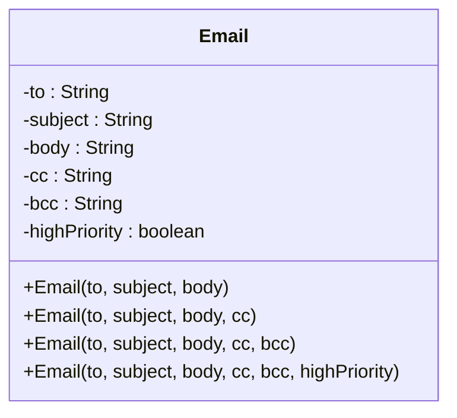

#### ✅ Après — Builder Pattern

```java
Email email = new Email.Builder("bob@example.com")
    .subject("Hello")
    .body("Meeting at 3pm")
    .cc("alice@example.com")
    .highPriority()
    .build();

public class Email {
    private final String to;
    private final String subject;
    private final String body;
    private final String cc;
    private final String bcc;
    private final boolean highPriority;

    private Email(Builder builder) {
        this.to          = builder.to;
        this.subject     = builder.subject;
        this.body        = builder.body;
        this.cc          = builder.cc;
        this.bcc         = builder.bcc;
        this.highPriority = builder.highPriority;
    }

    public static class Builder {
        private final String to;        // obligatoire
        private String subject = "";
        private String body    = "";
        private String cc      = null;
        private String bcc     = null;
        private boolean highPriority = false;

        public Builder(String to)            { this.to = to; }
        public Builder subject(String s)     { this.subject = s;      return this; }
        public Builder body(String b)        { this.body = b;         return this; }
        public Builder cc(String cc)         { this.cc = cc;          return this; }
        public Builder bcc(String bcc)       { this.bcc = bcc;        return this; }
        public Builder highPriority()        { this.highPriority = true; return this; }
        public Email build()                 { return new Email(this); }
    }
}
```

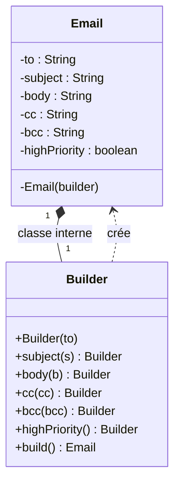

Plus d'infos [ici](https://refactoring.guru/design-patterns/builder).

### Application aux tests — Test Data Builders

#### Le problème : des tests fortement couplés à l'implémentation

Sans builder, chaque test instancie directement l'objet via son constructeur. Le jour où `Invoice` ajoute un champ obligatoire — disons `currency` — **tous les appels cassent** : tests et code de production confondus.

```scala
// 47 tests utilisent ce constructeur directement...
val invoice = new Invoice("John Doe", Country("France", EURO, FRENCH))

// On ajoute "currency" → 47 erreurs de compilation à corriger une par une
val invoice = new Invoice("John Doe", Country("France", EURO, FRENCH), EURO)
```

Les tests deviennent un **frein au refactoring** plutôt qu'un filet de sécurité.

#### Le Test Data Builder : un point d'interception

On extrait un builder dédié aux tests, avec des valeurs par défaut sensées. Quand le constructeur de `Invoice` change, **un seul endroit** absorbe le changement : le builder.

```scala
class InvoiceBuilder {
  private var client   = "Default Client"
  private var country  = France          // valeur par défaut sensée
  private var currency = EURO            // nouveau champ : on l'ajoute ici, une fois
  private var books    = List.empty[PurchasedBook]

  def from(country: Country): InvoiceBuilder  = { this.country = country;  this }
  def containing(b: PurchasedBook*): InvoiceBuilder = { books = b.toList; this }
  def build(): Invoice = new Invoice(client, country, currency, books)
}
```

Les 47 tests ne changent pas. Seul `InvoiceBuilder.build()` est mis à jour.

#### Éliminer l'irrelevant, amplifier l'essentiel

Le builder permet d'exprimer **uniquement ce qui compte** pour le cas testé — et de masquer tout le reste derrière des valeurs par défaut. Le test devient métier, pas technique.

```scala
// ❌ Bruit cognitif : que teste-t-on exactement ?
test("Converts_total_amount_to_usd") {
    val reportGenerator = new ReportGenerator

    val book = EducationalBook(
      "Domain-Driven Design",
      25,
      Author("Eric Evans", Country("USA", US_DOLLAR, ENGLISH)),
      ENGLISH,
      COMPUTER
    )
    val purchasedBook = new PurchasedBook(book, 2)
    val invoice = new Invoice("John Doe", Country("USA", US_DOLLAR, ENGLISH))
    invoice.addBook(purchasedBook)
    inMemoryRepository.addInvoice(invoice)

    assert(reportGenerator.getTotalAmount == 57.49)
    assert(reportGenerator.getNumberOfIssuedInvoices == 1)
    assert(reportGenerator.getTotalSoldBooks == 2)
  }

// ✅ L'intention est lisible en un coup d'œil
test("Converts_total_amount_to_usd") {
    // Eliminates the irrelevant, and amplifies the essentials of the test
    val reportGenerator =
      aReport(inMemoryRepository)
        .containing(
          anInvoice()
            .containing(
              aNovel(_.costing(12.99))
                .inQuantity(2),
              anEducationalBook(_.costing(29.87))
                .inQuantity(7)
            )
            .from(France)
            .build()
        )
        .build()

    assert(reportGenerator.getTotalAmount == 334.97)
    assert(reportGenerator.getNumberOfIssuedInvoices == 1)
    assert(reportGenerator.getTotalSoldBooks == 9)
  }
```

> *"This eliminates the irrelevant, and amplifies the essentials of the test."*
> — Robert C. Martin (Uncle Bob)

#### Avantages et inconvénients

| ✅ Avantages                                                                                                        | ⚠️ Inconvénients                                                                           |
|--------------------------------------------------------------------------------------------------------------------|--------------------------------------------------------------------------------------------|
| Point d'interception unique : un changement de signeture (constructeur, méthode, ...) se propage à un seul endroit | Coût initial : créer et maintenir un builder par objet de test                             |
| Tests découplés de l'implémentation — refactoring sans douleur                                                     | Risque de builders trop permissifs qui masquent des incohérences métier                    |
| Valeurs par défaut sensées : chaque test ne précise que ce qui le différencie                                      | Les valeurs par défaut peuvent devenir un angle mort si elles ne sont plus représentatives |
| Langage métier dans les tests : `anInvoice().from(France)` vs `new Invoice("x", Country(...))`                     | Sur-ingénierie pour des objets simples avec peu de champs                                  |

> Plus d'infos sur le pattern **Test Data Builder** : [xtrem-tdd.netlify.app](https://xtrem-tdd.netlify.app/Flavours/Testing/test-data-builders)

### Exemple du `Bouchonnois`

<table>
<tr>
<th>❌ Sans Test Data Builder</th>
<th>✅ Avec Test Data Builder</th>
</tr>
<tr>
<td>

```csharp
[Fact]
public void AvecUnChasseurAyantDesBalles
    EtAssezDeGalinettesSurLeTerrain()
{
    var id = Guid.NewGuid();
    var repository =
        new PartieDeChasseRepositoryForTests();

    repository.Add(new PartieDeChasse(
        id,
        new Terrain("Pitibon sur Sauldre")
            { NbGalinettes = 3 },
        new List<Chasseur>
        {
            new("Dédé")    { BallesRestantes = 20 },
            new("Bernard") { BallesRestantes = 8  },
            new("Robert")  { BallesRestantes = 12 },
        }));

    var service = new PartieDeChasseService(
        repository, TimeProvider);

    service.TirerSurUneGalinette(id, "Bernard");

    var saved = repository.SavedPartieDeChasse();
    saved!.Id.Should().Be(id);
    saved.Status.Should().Be(PartieStatus.EnCours);
    saved.Terrain.Nom
        .Should().Be("Pitibon sur Sauldre");
    saved.Terrain.NbGalinettes.Should().Be(2);
    saved.Chasseurs.Should().HaveCount(3);
    saved.Chasseurs[0].Nom.Should().Be("Dédé");
    saved.Chasseurs[0].BallesRestantes
        .Should().Be(20);
    saved.Chasseurs[0].NbGalinettes
        .Should().Be(0);
    saved.Chasseurs[1].Nom.Should().Be("Bernard");
    saved.Chasseurs[1].BallesRestantes
        .Should().Be(7);
    saved.Chasseurs[1].NbGalinettes
        .Should().Be(1);
    saved.Chasseurs[2].Nom.Should().Be("Robert");
    saved.Chasseurs[2].BallesRestantes
        .Should().Be(12);
    saved.Chasseurs[2].NbGalinettes
        .Should().Be(0);
    AssertLastEvent(saved,
        "Bernard tire sur une galinette");
}
```

</td>
<td>

```csharp
[Fact]
public void AvecUnChasseurAyantDesBalles
    EtAssezDeGalinettesSurLeTerrain()
{
    Given(
        UnePartieDeChasseExistante(
            SurUnTerrainRicheEnGalinettes()
        ));

    When(id =>
        PartieDeChasseService
            .TirerSurUneGalinette(id, Bernard));

    Then(savedPartieDeChasse =>
        savedPartieDeChasse
            .Should()
            .HaveEmittedEvent(
                Now,
                "Bernard tire sur une galinette"
            ).And
            .ChasseurATiréSurUneGalinette(
                Bernard,
                ballesRestantes: 7,
                galinettes: 1
            ).And
            .GalinettesSurLeTerrain(2)
    );
}
```

</td>
</tr>
</table>

Pour aller plus loin : [Refactoring du Bouchonnois](https://github.com/ythirion/refactoring-du-bouchonnois/)

---

## Gift Selection
Appliquer le pattern `Strategy` dans le cadre de la sélection de cadeau par les elfes et le père Noël.
L'énoncé se trouve [ici](https://coda-dijon.github.io/advent-2025/?day=10).

> Round 2 : comment mettre en place 1 `Strategy` sans classe ?

Guide étape par étape [ici](https://github.com/ythirion/advent-coda-2025/tree/main/day-10).

## Conclusion

Les design patterns sont un **vocabulaire partagé** entre développeurs. Ils ne sont pas des solutions à copier-coller, mais des **templates de pensée** — des intentions de conception reconnues et nommées.

**Ce qu'ils apportent :**
- Un langage commun pour discuter de conception
- Des solutions éprouvées à des problèmes récurrents
- Une base pour comprendre et critiquer du code existant

**Ce qu'ils ne sont pas :**
- Une fin en soi
- Obligatoirement la meilleure solution dans tous les contextes
- Un signe de bon code en eux-mêmes — un pattern mal appliqué est pire que pas de pattern

> "A design pattern is not a finished design that can be transformed directly into code. It is a description or template for how to solve a problem that can be used in many different situations."
> — GOF

## Ouverture
Il existe de nombreux patterns à différents niveaux et qui peuvent différer fonction des paradigmes de la stack utilisée :
- [Software Architecture Patterns](https://www.redhat.com/en/blog/14-software-architecture-patterns)
- [Enterprise Integration Patterns](https://www.enterpriseintegrationpatterns.com/patterns/messaging/)

## Ressources

- [Refactoring Guru — Design Patterns](https://refactoring.guru/design-patterns)
- [Refactoring Guru — Catalogue](https://refactoring.guru/design-patterns/catalog)
- [Design Patterns: Elements of Reusable Object-Oriented Software](https://www.oreilly.com/library/view/design-patterns-elements/0201633612/)
- [Head First Design Patterns](https://www.oreilly.com/library/view/head-first-design/9781492077992/)
- [Test Data Builders: an alternative to the Object Mother pattern](http://www.natpryce.com/articles/000714.html)