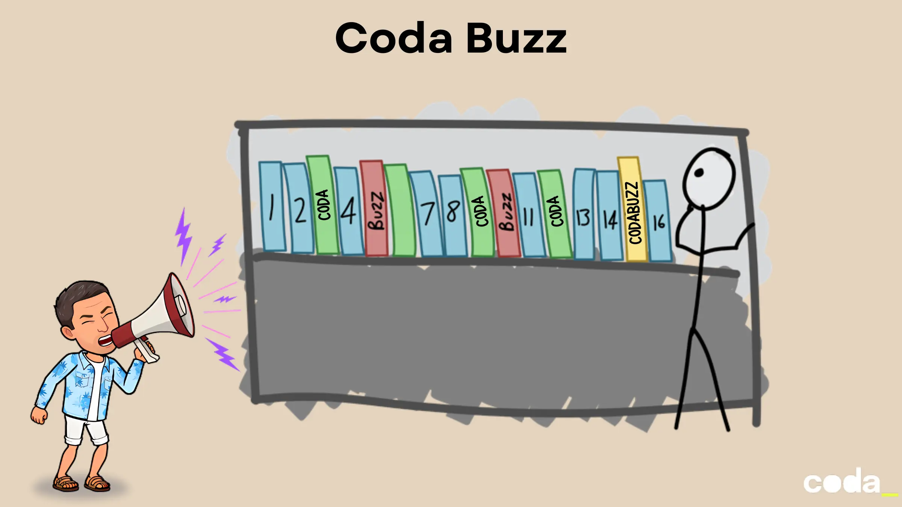
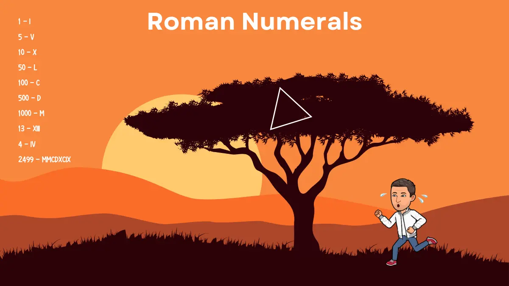
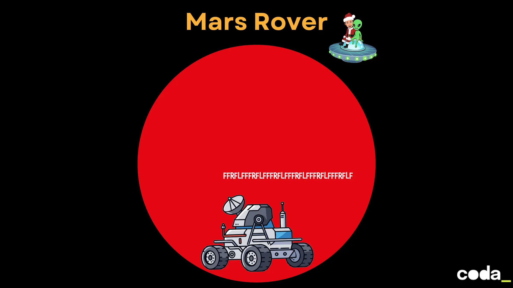

## CodaBuzz

Écrivez une fonction qui, pour un nombre de 1 à 100, retourne ce nombre, sauf :
- Pour les multiples de 3 : retourne `”Coda”`
- Pour les multiples de 5 : retourne `”Buzz”`
- Pour les multiples de 3 **et** de 5 : retourne `”CodaBuzz”`



> Avant de coder, construire un **Example Mapping**.

### Trop facile ?
- Supprimez les `if` de votre code
- Paramétrisez le code, implémentez cette méthode :
    - int limit : 100
    - int fizz : 3
    - int buzz : 5
- Étendez votre programme
    - Les multiples de 7 sont `Whizz`
    - Les multiples de 11 sont `Bang`
- Utilisez une `Higher Order Function`
- Ajoutez une sortie vocale
- Écrivez-le dans un langage inconnu (toujours en utilisant le TDD)
- ...

Un exemple d'implémentation [ici](https://github.com/advent-of-craft/2024/blob/main/docs/day02/solution/step-by-step.md).

---

## Roman Numerals
Implémentez un convertisseur de nombres romains.
Le système doit pouvoir prendre en charge des nombres décimaux allant jusqu'à `3999` et les convertir en leur équivalent romain.



```text
Exemples :
1 - I
5 - V
10 - X
50 - L
100 - C
500 - D
1000 - M
4 - IV
13 - XIII
2499 - MMCDXCIX
```

Démontrer les points suivants :
- `Fake it until you make it`
- `Triangulation`

Step-by-step disponible [ici](ROMAN-NUMERALS-SOLUTION.md).

## Mars Rover

Vous développez un logiciel pour contrôler **un rover** sur Mars. Le rover se déplace sur un plateau rectangulaire et exécute une série de commandes pour explorer la planète.



### Objectif

Écrire un programme qui permet de :
1. **Positionner un rover** sur un plateau martien
2. **Envoyer une série de commandes** pour le déplacer
3. **Afficher la position finale** du rover après exécution des commandes

### Spécifications

**Le plateau** — grille rectangulaire N x M, coordonnées de `(0,0)` en bas à gauche jusqu'à `(N,M)` en haut à droite.

**Le rover** — défini par sa position `(x, y)` et son orientation parmi `N`, `S`, `E`, `W`.
Exemple : `1 2 N` (x=1, y=2, face au Nord).

**Les commandes** :

| Commande | Effet                   |
|----------|-------------------------|
| `F`      | Avancer d'une case      |
| `R`      | Tourner à droite (90°)  |
| `L`      | Tourner à gauche (90°)  |

**Grille toroïdale** — le plateau n'a pas de bords : dépasser un bord renvoie automatiquement au bord opposé.

### Exemple

```
Plateau  : 5 5
Position : 1 2 N
Commandes: FFRFLF
Résultat : 1 4 W
```

### Par où commencer ?

Avant de coder, construire un **Example Mapping** :
- Quels sont les cas simples ? (avancer face au Nord, tourner à droite depuis l'Est…)
- Quels sont les cas limites ? (dépasser un bord, enchaîner plusieurs rotations…)
- Quelle est la plus petite tranche de valeur à implémenter en premier ?

> Commencez par `F` seul, sur une grille sans bords, avec le rover face au Nord. Un baby step à la fois.