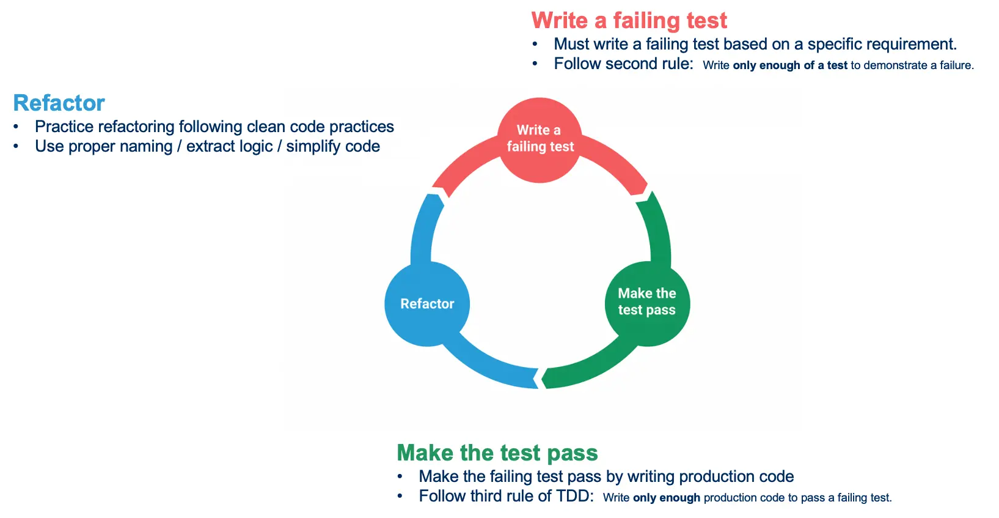
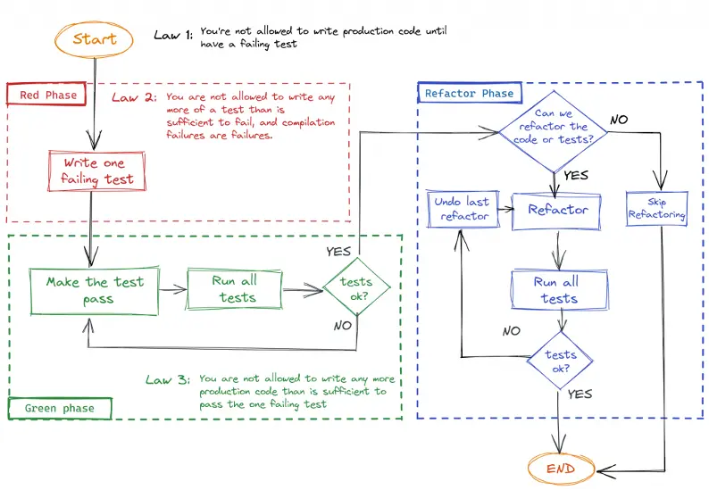
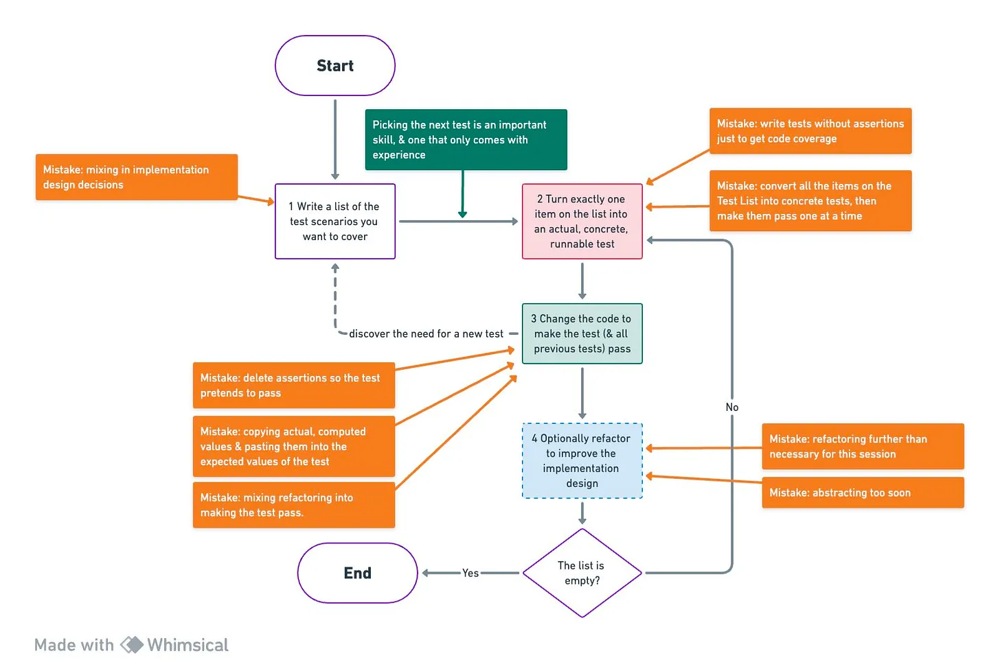
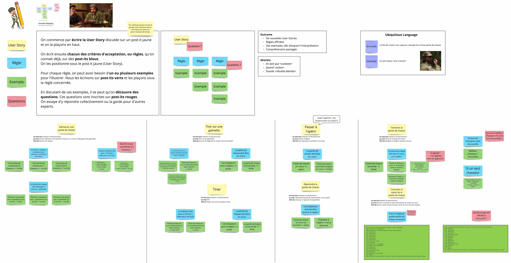
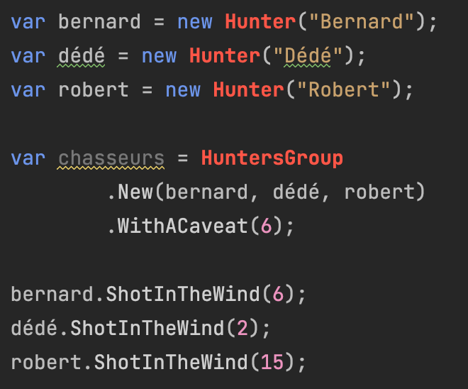
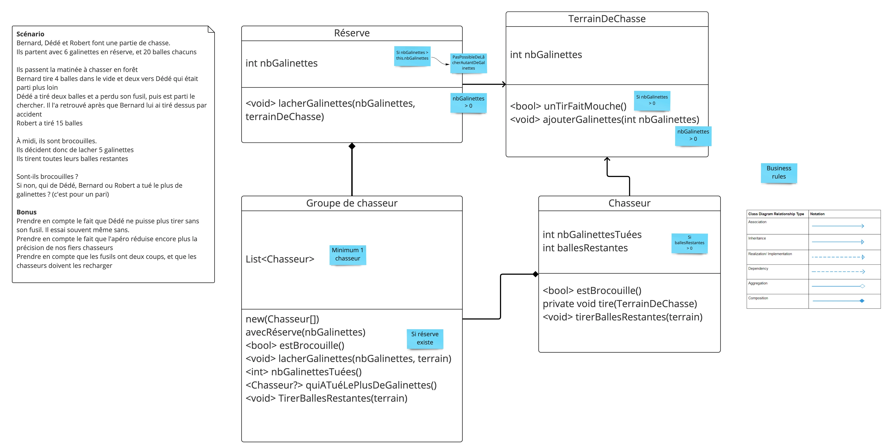

# TDD (Inside Out)
## Myth Busters TDD

En binôme, prenez 2 minutes pour décider si chaque affirmation est **vraie ou fausse** — et préparez un argument.

| # | Affirmation                                                                         | Vrai / Faux ? |
|---|-------------------------------------------------------------------------------------|---------------|
| 1 | "TDD c'est écrire des tests *après* le code, pour valider que ça marche"            | ?             |
| 2 | "TDD ralentit le développement — on passe deux fois plus de temps"                  | ?             |
| 3 | "TDD ne convient qu'aux projets simples ou greenfield"                              | ?             |
| 4 | "Si on a 100 % de couverture, on fait du TDD"                                       | ?             |
| 5 | "TDD améliore la conception du code, pas seulement sa qualité"                      | ?             |
| 6 | "On ne peut pas faire du TDD sur du code legacy"                                    | ?             |
| 7 | "TDD c'est écrire *tous* les tests avant de coder l'implémentation"                 | ?             |

> Mise en commun : chaque binôme défend sa position — puis on démystifie ensemble.

<details>
<summary>Corrections (à ne pas ouvrir avant la mise en commun !)</summary>

| # | Verdict    | Explication                                                                                                                                                                                                                                      |
|---|------------|--------------------------------------------------------------------------------------------------------------------------------------------------------------------------------------------------------------------------------------------------|
| 1 | ❌ **Faux** | TDD, c'est exactement l'inverse : on écrit le test **avant** le code de production. L'objectif n'est pas la validation a posteriori, mais de laisser le test **guider la conception**.                                                           |
| 2 | ❌ **Faux** | Des études (Microsoft, IBM) montrent que TDD réduit le taux de bugs de 40 à 90 %, ce qui compense largement le surcoût initial. Le débogage et les correctifs coûtent bien plus cher que les tests.                                              |
| 3 | ❌ **Faux** | TDD s'applique à tout type de projet. Sur les projets complexes ou long terme, c'est même là qu'il apporte le plus de valeur : le filet de tests permet de refactorer sans crainte à mesure que le système grandit.                              |
| 4 | ❌ **Faux** | La couverture mesure les lignes exécutées, pas l'intention. On peut atteindre 100 % avec des tests écrits *après*, sans assertions, ou qui ne testent rien de pertinent. TDD, c'est une **pratique de développement**, pas une métrique.         |
| 5 | ✅ **Vrai** | C'est l'essence même du TDD. En écrivant le test en premier, on est forcé de penser à l'API avant l'implémentation — ce qui conduit naturellement à un code plus simple, plus découplé, plus testable.                                           |
| 6 | ❌ **Faux** | On peut faire du TDD sur du code legacy en utilisant des techniques spécifiques : tests de caractérisation, Sprout Method/Class, Golden Master… Le TDD devient alors un outil de sécurisation progressive.                                       |
| 7 | ❌ **Faux** | TDD suit une boucle **un test à la fois** : Red → Green → Refactor. On n'écrit pas tous les tests d'avance — on en écrit un seul, on le fait passer, puis on passe au suivant. C'est une confusion fréquente avec d'autres approches test-first. |

</details>

---

## TDD, c'est quoi vraiment ?
### Qu'est-ce que le Test-Driven Development ?

Le TDD est une technique née d'un ensemble de convictions sur le code :

- La **simplicité** — l'art de maximiser la quantité de travail *non* effectué
- L'**évidence et la clarté** sont plus vertueuses que l'astuce
- Écrire du code **sans encombrement** est une composante clé du succès

C'est une méthodologie issue de l'Extreme Programming (XP), développée par `Kent Beck` lors de son travail sur le projet C3.

> "Test-Driven Development is a way of managing fear during programming." — Kent Beck

### Concevoir et structurer le code

Le TDD **ne porte pas sur les tests**.
Les tests sont un moyen d'arriver à nos fins, notre **filet de sécurité** — pas l'objectif.

Il s'agit de :
- Améliorer la **conception et la structure** du code
- Pouvoir **refactorer en toute sécurité** grâce aux tests

### Un biais vers la simplicité

Il existe plusieurs façons de mesurer la simplicité dans un logiciel :
- Moins de lignes de code par fonctionnalité
- Complexité cyclomatique plus basse
- Moins d'effets de bord
- Empreinte mémoire / CPU réduite

TDD nous force à construire la chose la plus simple qui fonctionne :
- Ne pas écrire plus de code que nécessaire (**YAGNI**)
- Résister à la tentation d'introduire de la complexité artificielle

Cela dit, le TDD n'est pas une baguette magique. Il ne réduit pas nécessairement :
- Le temps de développement
- Le nombre de lignes de code
- Le nombre de défauts

### Confiance accrue

Le TDD augmente notre confiance dans le code :
- Chaque nouveau test sollicite le système de façons nouvelles, non encore testées
- Au fil du temps, la suite de tests nous protège contre les régressions
- On dispose en permanence d'un **retour rapide** sur l'état du système (*fast feedback-loop*)

### Les briques du TDD

Le TDD est une approche **scientifique** du développement logiciel :
- Écrire une hypothèse
- Lancer l'expérience
- Observer le résultat
- Essayer autre chose
- Recommencer…

C'est un processus en **3 phases** :



| Phase           | Description                                                                                                                                                                          |
|-----------------|--------------------------------------------------------------------------------------------------------------------------------------------------------------------------------------|
| 🔴 **Red**      | Écrire un test qui échoue (y compris les échecs de compilation) — exécuter la suite pour vérifier l'échec                                                                            |
| 🟢 **Green**    | Écrire **juste assez** de code de production pour faire passer le test — être le "développeur sale" une minute (hardcoder, dupliquer, copier-coller) — cette étape doit être rapide  |
| 🔵 **Refactor** | Supprimer les code smells — duplication, valeurs en dur, mauvaise utilisation des idiomes du langage… — si un test casse : priorité au retour au vert avant de sortir de cette phase |

### Les 3 règles d'Uncle Bob



1. N'écrire du code de production **que** pour faire passer un test unitaire en échec.
2. N'écrire d'un test unitaire **que** ce qui est suffisant pour échouer (les erreurs de compilation sont des échecs).
3. N'écrire du code de production **que** ce qui est nécessaire pour faire passer le seul test en échec.

### Baby Steps

Les *baby steps* (petits pas) sont le rythme naturel du TDD : **avancer par incréments minuscules**, en restant le plus souvent possible dans un état stable (tests au vert).

> "Make it work, make it right, make it fast." — Kent Beck

L'idée : chaque pas doit être si petit qu'il est **impossible de se perdre**. Si un test prend plus de quelques minutes à passer, c'est qu'on a mordu trop grand.

**Pourquoi c'est important :**

| Grosse étape                      | Baby step                                             |
|-----------------------------------|-------------------------------------------------------|
| On est rouge longtemps            | On revient au vert rapidement                         |
| On accumule plusieurs changements | Un seul changement à la fois = cause d'échec évidente |
| Refactoring risqué                | Refactoring sûr sur base stable                       |
| Difficile d'annuler               | `git checkout` ou `Ctrl+Z` suffit                     |

**En pratique :**
- Commencer par le cas le plus simple possible (souvent le cas trivial ou le cas nul)
- Résister à l'envie de "tout faire en une fois"
- Si le test rouge semble trop complexe à faire passer : le découper en un test encore plus petit
- Hardcoder la valeur en phase Green si nécessaire — la généralisation vient au Refactor ou au test suivant

### Le Pair Programming en TDD

Changer de rôle à chaque **nouveau test en rouge**.

> C'est le style **Ping-Pong** : l'un écrit le test rouge, l'autre écrit le code vert et refactore, puis les rôles s'inversent.

### Canon TDD : partir des exemples


---

### Example Mapping

L'**Example Mapping** est une technique collaborative pour clarifier les critères d'acceptation d'une User Story *avant* de coder.



#### Comment ça se déroule

1. **Présenter** — un expert métier introduit la story avec des exemples concrets
2. **Construire** — l'équipe pose des questions, identifie les règles et les cas limites
3. **Formaliser** — les exemples peuvent être écrits en Gherkin (Given / When / Then)

#### Bonnes pratiques

- Laisser un temps de réflexion individuelle avant la discussion de groupe
- Capturer le **Ubiquitous Language** : quand une ambiguïté de vocabulaire surgit, notez-la et définissez-la ensemble
- S'arrêter quand le périmètre est clair — ou quand le temps est écoulé

> L'outcome n'est pas un document. C'est une **compréhension partagée**.

---

### Generate Code From Usage

**Principe :** écrire d'abord l'appel (le test), *puis* laisser l'IDE générer la structure.



```
Contrainte : vous n'avez le droit de créer du code nouveau
             qu'à partir de son usage (depuis un test ou du code de production).
```

#### Workflow

1. Écrire le test comme si le code existait déjà
2. L'IDE souligne les identifiants manquants en rouge
3. Utiliser l'action contextuelle (`Alt+Enter` / `⌥⏎`) pour générer :
   - une classe
   - une méthode
   - une propriété
   - un type
4. Se déplacer vers l'erreur suivante (raccourcis IDE) et recommencer

#### Pourquoi cette approche ?

- Elle maintient le **flux de pensée** : on reste dans l'intention, pas dans l'implémentation
- Elle garantit une **API orientée usage** : on conçoit depuis le point de vue de l'appelant
- Elle réduit les erreurs de copier-coller manuels
- Elle est **parfaitement alignée avec TDD** : Red d'abord, génération ensuite

---

## Generate Code From Usage en pratique

### Une partie de chasse du Bouchonnois


En binôme, implémentez le scénario et les classes ci-dessous **en générant le code depuis son usage**.



Notez les raccourcis découverts au fil de la session.

---

## Prise en main
[Code Katas](CODE-KATAS.md)

---

## Utiliser TDD sur du code existant

TDD n'est pas réservé au greenfield. Sur du code legacy, la démarche s'adapte : on **sécurise d'abord**, puis on refactore, puis on avance en TDD.

### Pourquoi c'est difficile

Le code existant est rarement testable tel quel :
- Dépendances cachées (base de données, système de fichiers, horloge...)
- Classes omniscientes, méthodes de 300 lignes
- Couplage fort entre les modules

On ne peut pas écrire le test en premier si le code ne peut pas être instancié en isolation.

### La démarche en 3 temps

```
1. Caractériser  →  comprendre et figer le comportement actuel
2. Sécuriser     →  rendre le code testable (sans changer le comportement)
3. Avancer       →  reprendre le cycle Red → Green → Refactor
```

### Techniques clés

| Technique                    | Quand l'utiliser                                                               |
|------------------------------|--------------------------------------------------------------------------------|
| **Tests de caractérisation** | Avant toute modification — figer le comportement observé (même s'il est buggé) |
| **Golden Master**            | Sorties volumineuses (HTML, CSV, JSON) — comparer output avant/après           |
| **Sprout Method**            | Ajouter une nouvelle fonctionnalité sans toucher au code existant              |
| **Sprout Class**             | Variante : isoler la nouvelle logique dans une classe dédiée                   |
| **Seam (couture)**           | Identifier un point où injecter un comportement de test sans modifier le code  |

### Règle d'or

> Ne jamais modifier du code non couvert par des tests.

Avant de refactorer, écrire les tests qui prouvent que le comportement est préservé.

---

## Conclusion

### Ce qu'on retient

- Le TDD n'est pas une technique de test — c'est une **technique de design**
- Commencer par les **exemples** clarifie le comportement *avant* d'écrire une ligne
- L'**Example Mapping** structure cette réflexion collective
- Écrire d'abord l'usage (test) puis générer le code maintient le flux et oriente l'API
- Un cycle court (rouge → vert → refactor) est un filet de sécurité permanent

### Le test comme documentation vivante

```typescript
// ❌ Test opaque
it('test fizzBuzz', () => {
  expect(fizzBuzz(15)).toBe('FizzBuzz')
})

// ✅ Test documenté
it('retourne FizzBuzz pour les multiples de 3 et de 5', () => {
  const nombreMultipleDe3Et5 = 15

  const resultat = fizzBuzz(nombreMultipleDe3Et5)

  expect(resultat).toBe('FizzBuzz')
})
```

Un bon test répond à trois questions sans les commenter : **quoi, avec quoi, pourquoi ?**

### Questions pour la suite

- Qu'est-ce qui change dans votre façon de commencer une feature demain matin ?
- Dans quel contexte de votre quotidien pourriez-vous appliquer l'`Example Mapping` ?
- Quel raccourci IDE allez-vous adopter cette semaine ?

---

## Ressources

- [Concepts derrière T.D.D](https://github.com/les-tontons-crafters/xtrem-tdd-money-kata/blob/main/docs/concepts.md)
- [Canon T.D.D](https://tidyfirst.substack.com/p/canon-tdd)
- [Example Mapping](https://xtrem-tdd.netlify.app/flavours/practices/example-mapping/)
- [Generate Code From Usage](https://xtrem-tdd.netlify.app/flavours/design/generate-code-from-usage/)
- [FizzBuzz Kata](https://github.com/ythirion/fizzbuzz-kata)
- [Test-Driven Development by Example](https://www.amazon.com/Test-Driven-Development-Kent-Beck/dp/0321146530)
- [Software Craft — TDD, Clean Code et autres pratiques essentielles](https://www.dunod.com/sciences-techniques/software-craft-tdd-clean-code-et-autres-pratiques-essentielles-0)
