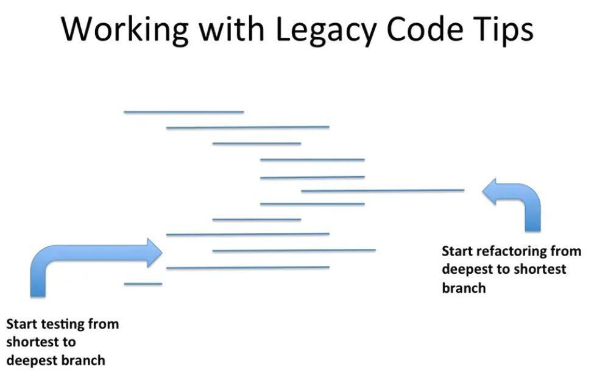
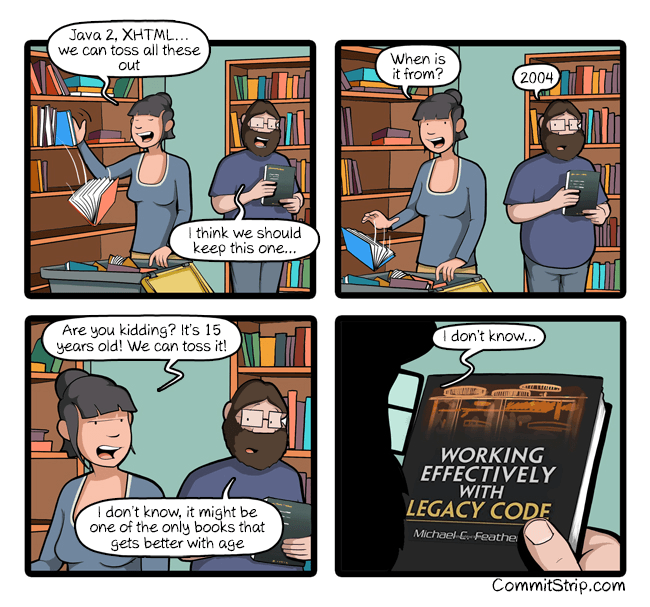

# Refactorer du code legacy

> En binôme, discutez 2 minutes :

- Pour vous, c'est quoi du **code legacy** ?
- Avez-vous déjà eu peur de modifier du code ? Pourquoi ?
- Qu'est-ce qui vous manquait pour vous sentir en confiance ?

---

## Qu'est-ce que le code legacy ?


### La définition de Michael Feathers

> *"Code legacy, c'est du code sans tests."*
> — Michael Feathers, *Working Effectively with Legacy Code*

Pour Feathers, la dangerosité du code ne vient pas de son âge, ni de sa complexité intrinsèque, mais de l'**absence de filet de sécurité**. Sans tests, chaque modification est un saut dans le vide.

### La définition d'Adam Tornhill

> *"Le code legacy, c'est du code que personne ne comprend plus — et que tout le monde a peur de toucher."*
> — Adam Tornhill, *Your Code as a Crime Scene*

Tornhill apporte une dimension **sociale et organisationnelle** : les fichiers les plus modifiés, par le plus grand nombre de personnes, au fil du temps, sont souvent les plus fragiles. Il appelle ces zones des **hotspots** — croisement entre complexité technique et fréquence de changement.

### En résumé

| Dimension             | Ce qui rend le code dangereux                           |
|-----------------------|---------------------------------------------------------|
| **Technique**         | Pas de tests, dépendances couplées, état global         |
| **Cognitive**         | Personne ne comprend l'intention d'origine              |
| **Organisationnelle** | Tout le monde le modifie, personne n'en est responsable |

---

## La règle d'or

> **Vous ne pouvez pas modifier du code qui n'est pas couvert par des tests.**

La seule exception : si vous devez modifier le code pour *ajouter* des tests, seuls les **refactorings automatisés** (via l'IDE) sont autorisés — sans changer le comportement.



- Start testing from shortest to deepest branch
- Start refactoring from deepest to shortest branch

---

## Techniques pour sécuriser du code legacy

### 1. Tests de caractérisation

Avant de refactorer, il faut comprendre et figer le comportement existant.

Un **test de caractérisation** ne teste pas ce que le code *devrait* faire — il teste ce qu'il *fait aujourd'hui*.

```
1. Écrire un test qui appelle le code
2. Le laisser échouer pour observer ce qu'il retourne réellement
3. Utiliser cette valeur comme valeur attendue
4. Le test devient un filet : il détecte toute régression involontaire
```

> Ces tests décrivent le comportement actuel, pas le comportement souhaité.

### 2. Les Seams (points de couture)

Ajouter des tests sur du code legacy est difficile car il n'a pas été conçu pour être testé. Le problème est presque toujours un **problème de dépendances** :

- Une connexion base de données
- Un serveur tiers
- Un Singleton global
- Un paramètre complexe à instancier

> **Un Seam est un endroit où l'on peut modifier le comportement d'un programme sans changer le code source.**

En POO, le Seam le plus courant est **l'objet lui-même**. On peut sous-classer pour surcharger le comportement problématique en test :

```scala
// Production : dépendance dure sur UserSession (Singleton)
protected def getLoggedUser = UserSession.getLoggedUser()

// Test : on sous-classe et on surcharge
class TripServiceForTest(loggedUser: User) extends TripService {
  override def getLoggedUser: User = loggedUser
}
```

### 3. Refactorings automatisés

Quand le code n'est pas encore couvert, on n'a pas le droit de le modifier à la main. On utilise les **refactorings automatiques de l'IDE** qui garantissent la préservation du comportement :

- **Extract Method** — isoler une dépendance dans sa propre méthode (pour créer un Seam)
- **Change Signature** — injecter une dépendance en paramètre
- **Rename** — clarifier l'intention sans risque

### 4. La couverture comme pilote

Après avoir écrit les premiers tests, on utilise le **rapport de couverture** comme guide :

- Les branches non couvertes indiquent les cas de test manquants
- On avance **de la branche la plus courte vers la plus profonde**

### 5. Le mutation testing

Une fois le code couvert, on peut vérifier la **qualité** des tests avec le mutation testing.

L'outil injecte automatiquement des mutations dans le code (changer `==` en `!=`, supprimer une condition...) et vérifie que vos tests les détectent.

> Un test qui ne tue pas de mutant ne prouve rien.

---

## Trip Service Kata

### Contexte

Vous héritez du service suivant. Il calcule les voyages d'un utilisateur visibles par la personne connectée :

```scala
class TripServiceBackup {
  def getTripsByUser(user: User): List[Trip] = {
    var tripList: List[Trip] = List()
    val loggedInUser = UserSession getLoggedUser ()
    var isFriend = false
    if (loggedInUser != null) {
      breakable {
        for (friend <- user.friends()) {
          if (friend == loggedInUser) {
            isFriend = true
            break
          }
        }
      }
      if (isFriend) {
        tripList = TripDAO.findTripsByUser(user)
      }
      tripList
    } else {
      throw new UserNotLoggedInException
    }
  }
}
```

### Objectif

Refactorer ce code pour qu'il respecte les principes du Clean Code / SOLID — **sans jamais modifier du code non couvert par des tests**.

### Conseils

- Commencez les tests **de la branche la plus courte à la plus profonde**
- Commencez le refactoring **de la branche la plus profonde à la plus courte**

---

### Étape 1 — Identifier les code smells

Avant tout, lisez le code et identifiez les problèmes :

- Quels code smells voyez-vous ?
- Qu'est-ce qui rend ce code difficile à tester ?
- Quelles sont les dépendances problématiques ?

<details>
<summary>Code smells identifiés</summary>

- `UserSession.getLoggedUser()` — Singleton global, impossible à remplacer en test
- `TripDAO.findTripsByUser(user)` — appel statique sur une classe DAO, dépendance dure
- Boucle `for` avec `breakable` — **Feature Envy** : la logique d'amitié appartient à `User`, pas à `TripService`
- `var tripList` et `var isFriend` — état mutable inutile
- `null` check sur `loggedInUser` — contrat implicite, non exprimé dans le type

</details>

---

### Étape 2 — Écrire un premier test naïf

Essayez d'écrire un test pour `getTripsByUser`. Que se passe-t-il ?

```scala
class TripServiceSpec extends AnyFlatSpec {
  it should "throw when user is not logged in" in {
    val tripService = new TripServiceBackup()
    // Que se passe-t-il quand on appelle getTripsByUser ?
  }
}
```

> `UserSession.getLoggedUser()` sera appelé — et en dehors d'un contexte HTTP, il explose.

---

### Étape 3 — Créer un Seam avec Extract Method

On ne peut pas modifier le code directement. On utilise un **refactoring automatique** :

1. Sélectionner `UserSession getLoggedUser()` dans l'IDE
2. **Extract Method** → `getLoggedUser`
3. Passer la méthode de `private` à `protected`

```scala
protected def getLoggedUser: User = UserSession.getLoggedUser()
```

De même pour le TripDAO :

```scala
protected def findTripsByUser(user: User): List[Trip] = TripDAO.findTripsByUser(user)
```

---

### Étape 4 — Sous-classer pour les tests

```scala
class TestableTripService(
  loggedUser: User,
  tripsForUser: List[Trip]
) extends TripServiceBackup {
  override protected def getLoggedUser: User = loggedUser
  override protected def findTripsByUser(user: User): List[Trip] = tripsForUser
}
```

On peut maintenant écrire des tests :

```scala
it should "throw UserNotLoggedInException when no user is logged in" in {
  val tripService = new TestableTripService(loggedUser = null, tripsForUser = List())
  assertThrows[UserNotLoggedInException] {
    tripService.getTripsByUser(anyUser)
  }
}
```

---

### Étape 5 — Utiliser la couverture comme pilote

Lancer la couverture de code et identifier les branches non couvertes.

Cas de test à couvrir :

```text
Utilisateur non connecté → lancer UserNotLoggedInException
Utilisateur connecté, pas ami avec l'utilisateur cible → retourner une liste vide
Utilisateur connecté, ami avec l'utilisateur cible → retourner les voyages
```

---

### Étape 6 — Test Data Builders

Les setups de tests deviennent vite illisibles :

```scala
val aUserWithTrips = new User()
aUserWithTrips.addTrip(toPortugal)
aUserWithTrips.addTrip(toSpringfield)
aUserWithTrips.addFriend(anotherUser)
aUserWithTrips.addFriend(loggedInUser)
```

On utilise le pattern **Test Data Builder** pour les rendre expressifs :

```scala
UserBuilder.aUser()
  .friendsWith(loggedInUser)
  .withTrips(toPortugal, toSpringfield)
  .build()
```

---

### Étape 7 — Refactoring : Feature Envy & Sprout Technique

La logique d'amitié n'appartient pas à `TripService`, elle appartient à `User`.

C'est une application de la **Sprout Technique** (Feathers) : plutôt que de modifier du code legacy non couvert, on **pousse le nouveau comportement dans une nouvelle méthode testable** — ici sur `User`. On écrit les tests d'abord, puis on branche.

> La Sprout Technique permet d'ajouter du comportement propre sans contaminer le code legacy existant.
> — [Nicolas Carlo, Understanding Legacy Code](https://understandlegacycode.com/blog/key-points-of-working-effectively-with-legacy-code/#identify-seams-to-break-your-code-dependencies)

On applique le TDD pour ajouter ce comportement sur `User` :

```scala
// Test
"User" should "inform when users are not friends" in {
  val user = UserBuilder.aUser().build()
  val stranger = UserBuilder.aUser().build()
  user.isFriendWith(stranger) mustBe false
}

it should "inform when users are friends" in {
  val loggedUser = UserBuilder.aUser().build()
  val user = UserBuilder.aUser().friendsWith(loggedUser).build()
  user.isFriendWith(loggedUser) mustBe true
}
```

On peut ensuite simplifier `TripService` :

```scala
if (user.isFriendWith(loggedInUser)) findTripsByUser(user) else emptyTrips
```

---

### Étape 8 — Rendre les contrats explicites

Remplacer le `throw` implicite par un type explicite avec `Try` :

```scala
def getTripsByUser(user: User): Try[List[Trip]] =
  checkUser(getLoggedUser) { loggedUser =>
    if (user.isFriendWith(loggedUser)) findTripsByUser(user) else emptyTrips
  }
```

---

### Étape 9 — Injecter les dépendances

Avec le **Change Signature** de l'IDE :

1. Injecter `loggedUser` en paramètre de méthode (supprimer le Singleton)
2. Injecter `TripDAO` en paramètre du constructeur

```scala
class TripService(val tripDAO: TripDAO) {
  def getFriendTrips(user: User, loggedUser: User): Try[List[Trip]] = ...
}
```

Guide étape par étape disponible [ici](https://github.com/ythirion/scala-kata-logs/blob/main/TripServiceKata/solution/step-by-step.md).

---

## Conclusion

### Ce qu'on retient

- Le code legacy, c'est avant tout du **code sans tests** (Feathers) — pas nécessairement du vieux code
- Les **tests de caractérisation** figent le comportement existant avant tout refactoring
- Les **Seams** permettent de rendre le code testable sans le modifier à la main
- Les **refactorings automatisés de l'IDE** sont les seuls autorisés sur du code non couvert
- La **couverture de code** est un pilote, pas un objectif — elle guide l'ordre d'écriture des tests
- Le **mutation testing** vérifie que vos tests ont réellement du sens

### Questions pour la suite

- Qu'avez-vous ressenti en découvrant le code pour la première fois ?
- Quelle a été la partie la plus difficile à tester ?
- Quel refactoring vous a semblé le plus risqué ? Le moins risqué ?
- Dans votre projet actuel, y a-t-il des zones de code qui ressemblent à ce kata ?



---

## Ressources

- [Step-by-step guide](https://github.com/ythirion/scala-kata-logs/blob/main/TripServiceKata/solution/step-by-step.md)
- [Kata original — Sandro Mancuso](https://github.com/sandromancuso/trip-service-kata/)
- [Sandro Mancuso — Testing Legacy with Hard-wired Dependencies](https://www.codurance.com/publications/2011/07/16/testing-legacy-hard-wired-dependencies)
- [Nicolas Carlo — Understand Legacy Code](https://understandlegacycode.com/blog/key-points-of-working-effectively-with-legacy-code/#identify-seams-to-break-your-code-dependencies)
- [Michael Feathers — Working Effectively with Legacy Code](https://www.oreilly.com/library/view/working-effectively-with/0131177052/)
- [Adam Tornhill — Your Code as a Crime Scene](https://pragprog.com/titles/atcrime2/your-code-as-a-crime-scene-second-edition/)

[](https://youtu.be/LSqbXorkyfQ)
