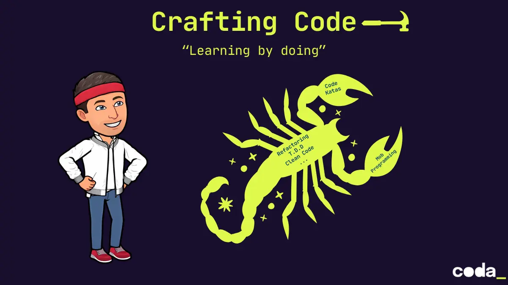

- [Artisanat logiciel](01.craft/)
- [Mais au fait c'est quoi la qualité ?](02.code-quality/)
- [Découvrir une nouvelle base de code](03.code-discovery/)
- [Clean Code](04.clean-code/)
- [Écrire du code S.O.L.I.D](05.solid/)
- [Une histoire de patterns](06.design-patterns/)
- [Object Calisthenics](07.object-calisthenics/)

## Evaluations
- [Identifier les Code smells](evals/01.CODE-SMELLS.md)
- [Solid Calisthenics](evals/02.SOLID-CALISTHENICS.md)

[Notes prises durant le cours](00.notes/)

  

